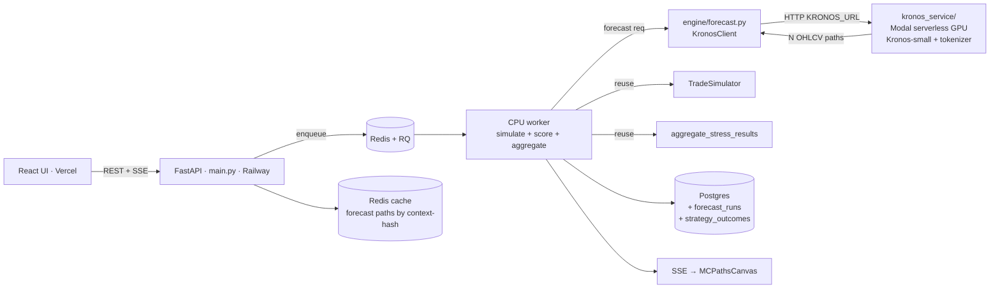

# Kronos Integration Plan — Whole-Workflow, All Use Cases

> Companion to `Kronos.md` (the CTO strategy doc) and `ROADMAP.md` (Track 2).
> This is the **engineering integration plan**: every Kronos use case mapped to
> concrete endpoints, files, data contracts, and the existing code it reuses.
>
> **One sentence:** Kronos is a *stateless forward-OHLCV-path generator* behind an
> async job layer; everything valuable is that one capability re-skinned, and it
> plugs into the pipeline we already have — `TradeSimulator` → `metrics` →
> `aggregate_stress_results` → SSE → `MCPathsCanvas` — without rewriting them.

---

## 0. The core idea (why this is cheap)

Our **stress tester already is** "generate N price paths → run the strategy on each → aggregate → stream → render." Kronos only swaps **where the paths come from**:

```
TODAY  (engine/stress.py):
  apply_stress(real_df, scenario, severity)  →  N perturbed parametric paths
KRONOS (engine/forecast.py):
  KronosClient.forecast(context_df, horizon, n_paths, T, top_p)  →  N generated paths
            ↓ (identical from here on — REUSED VERBATIM)
  for path: run_single_backtest(path, strategy, params) → calculate_metrics
  aggregate_stress_results(...) → {baseline, per_run, percentiles, spaghetti}
  SSE: {baseline → run×N → complete}
  MCPathsCanvas renders
```

So the integration is: **(a)** a Kronos inference service, **(b)** a thin
`KronosClient` + path-generation adapter, **(c)** an async job layer (the one
architectural debt Kronos forces us to pay), **(d)** new endpoints that mirror
the stress endpoints, **(e)** frontend pages that reuse the canvas. Plus the
**data moat** (`StrategyOutcome`, already shipped) that powers the
non-Kronos intelligence layer.

---

## 1. Architecture

### 1.1 Target topology


### 1.2 The three new backend modules
| Module | Responsibility |
|--------|----------------|
| `kronos_service/` | Standalone deployable (Modal/FastAPI). Loads `Kronos-small` + `Kronos-Tokenizer-base`. `POST /forecast` → JSON list of N future OHLCV frames. **Isolated black box** — no DB, no business logic. |
| `engine/forecast.py` | `KronosClient` (HTTP to `KRONOS_URL`, retry/timeout, local-CPU dev fallback) + `run_forward_test(df, strategy_cls, params, sim_kwargs, capital, horizon, n_paths, T, top_p)` that loops Kronos paths through the **existing** `run_single_backtest` + `aggregate_stress_results`. |
| `engine/intelligence.py` | The **non-Kronos** discriminative layer: gradient-boosting ranker trained on `StrategyOutcome`. Kronos forecasts *validate* its recommendations; it does not run Kronos. |

### 1.3 Async job layer (hard prerequisite — applies to all Kronos use cases)
Kronos inference is seconds-to-tens-of-seconds; **it cannot run inline in a blocking FastAPI request.** Before any GPU use case ships:
- Add **Redis + RQ** (`engine/jobs.py`): `enqueue_forecast(...)`, job status table.
- Endpoints return a `job_id`; the SSE stream (or a polling `GET /api/jobs/{id}`) delivers progress. The existing `/api/stress/stream` is already `async def` + `asyncio.to_thread` — forecast streaming copies that exact structure.
- Migrate **SQLite → Postgres** (`DATABASE_URL` + Alembic) so concurrent worker writes don't hit the single-writer SQLite wall.

### 1.4 Data contract — the Kronos boundary (freeze this first)
`KronosClient.forecast()` returns **a list of N pandas DataFrames**, each with the
canonical columns the whole codebase already expects:
`timestamp, open, high, low, close, volume`. Timestamps continue from the
context window at the same interval. This is the *only* contract Kronos must
honor; downstream code is untouched because it already consumes this shape from
`data/fetcher.py` and `apply_stress`.

---

## 2. Use cases — all of them, mapped to code

Each use case below lists: **role of Kronos**, **data flow**, **new endpoints**,
**files**, **what it reuses**, **frontend**, and **how it ties to the strategy
work already shipped** (indicator presets + rule builder + outcome log).

### UC-1 · AI Forward-Test  ★ FLAGSHIP
**What:** "Run *my* strategy on 100 plausible futures of this asset; in what % is it profitable, and what's the return distribution?"
- **Kronos role:** generate N forward OHLCV paths from a real context window.
- **Works with every strategy** — GRID/DCA/PLA **and** the new RSI/MACD/Bollinger/Supertrend/Donchian/MACross presets **and** CUSTOM rule-builder strategies. No per-strategy work: dispatch is the existing `STRATEGY_REGISTRY` + `run_single_backtest`.
- **Flow:** `fetcher.fetch(context)` → `validator` → `KronosClient.forecast(horizon=90, n_paths=100, T, top_p)` → loop `run_single_backtest` → `aggregate_stress_results` → SSE.
- **Endpoints:** `POST /api/forecast/run` (sync/job) + `POST /api/forecast/stream` (SSE, mirrors `stream_stress_sse`).
- **Files:** `engine/forecast.py`, `main.py` (+2 endpoints), `models.py` (`ForecastRun` table).
- **Reuses:** `run_single_backtest`, `aggregate_stress_results`, `run_trade_mc`, SSE event shape, `MCPathsCanvas`/`StressResults`.
- **Frontend:** new "Forward Test" page pill in `App.tsx`; `streamForwardTest()` in `api.ts` (copy of `streamStressTest`); same dynamic strategy form (Track-1 `StrategyParamsForm`/`RuleBuilder`) so any strategy is forward-testable.
- **Verdict UI:** "profitable in 73/100 futures · P5/P50/P95 return" — reuse stress verdict logic.

### UC-2 · Crisis Simulator (Kronos + parametric scaffold hybrid)
**What:** "Show me how my strategy survives a flash crash / COVID-style drop / LUNA collapse" — but with *realistic micro-structure*, not just a smooth parametric drift.
- **Kronos role:** fill realistic intra-path volatility/wicks; the **scaffold imposes the macro shock shape**.
- **Flow:** pick a preset from `SCENARIO_PRESETS` (we have 17) → Kronos generates a continuation → `apply_stress(generated_path, scenario, severity, persist=True)` overlays the shock shape → run strategy → aggregate. (The scaffold steers; Kronos textures.)
- **Endpoints:** `POST /api/forecast/crisis` (+ stream) — takes `scenario_key` + Kronos params.
- **Files:** `engine/forecast.py` (`run_crisis_sim` mode), reuse `engine/stress.py` `apply_stress`/`SCENARIO_PRESETS`/`SCENARIO_DEFAULTS`.
- **Reuses:** all of UC-1 + the entire stress scaffold. Frontend largely reuses the Stress page; add a "generated micro-structure" toggle.
- **Honest framing:** Kronos does *not* generate "labeled COVID variants" on demand — our scaffold names/shapes the crisis, Kronos makes the candles believable.

### UC-3 · Synthetic Data Augmentation / Market Replay
**What:** Generate large synthetic OHLCV corpora to (a) backtest on far more data than history provides, (b) build the NSE/BSE corpus, (c) feed the eval harness.
- **Kronos role:** unconditional-ish generation seeded from many real context windows.
- **Flow:** batch job → `KronosClient.forecast` over many seeds/symbols → persist to `OHLCVData` (tagged `source="kronos_synthetic"`) → reusable by every existing backtest/optimizer (`crypto_optimizer.py`, `indian_futures_optimizer.py`).
- **Endpoints:** internal/admin `POST /api/forecast/generate_corpus` (job, admin-token gated).
- **Files:** `engine/forecast.py` (`generate_corpus`), `data/fetcher.py` (read synthetic rows transparently).
- **Reuses:** the entire backtest + optimizer stack unchanged (synthetic data looks like real data to them).
- **Note:** this is also how we build the **LoRA fine-tune corpus** if the eval harness later justifies it (NSE/BSE is the likely case).

### UC-4 · AI Paper Trading (inside generated environments)
**What:** User trades *live* (manually or via a strategy) through a Kronos-generated future they can't see ahead of — a training sandbox / "what if I traded this scenario."
- **Kronos role:** generate the forward environment; optionally extend it candle-by-candle (streaming continuation).
- **Flow:** create a session → Kronos generates a horizon (or rolling windows) → a paper-trade loop feeds candles to the UI; user/strategy orders go through `TradeSimulator` in incremental mode.
- **Endpoints:** `POST /api/paper/session`, `POST /api/paper/{id}/order`, `GET /api/paper/{id}/step` (or WS).
- **Files:** new `engine/paper.py` (session state + incremental sim), `engine/forecast.py` (rolling continuation), `models.py` (`PaperSession`, `PaperOrder`).
- **Reuses:** `TradeSimulator` (extend with an incremental `step()` API), `metrics`.
- **Effort:** highest; build last. Depends on UC-1 maturity + a real-time loop.

### UC-5 · Strategy-Intelligence Ranker  (NON-Kronos — but Kronos-validated)
**What:** "For THIS asset + current regime, which strategy is likely to do well?" — the deepest moat, trained on **our own** `StrategyOutcome` log (already shipping rows).
- **Kronos role:** **none for training** (this is gradient boosting on tabular outcomes). Kronos's job is to **forward-test the ranker's top recommendation** (UC-1) so the recommendation comes with a forward-distribution, not just a backward-looking score.
- **Flow:** nightly job trains GBM on `StrategyOutcome` (features: indicator/strategy type, params, regime_mix, asset class; target: Sharpe/return) → `GET /api/recommend?symbol=...` returns ranked strategies → user clicks "validate" → UC-1 forward-test.
- **Endpoints:** `GET /api/recommend`, `POST /api/intelligence/retrain` (admin).
- **Files:** `engine/intelligence.py` (train/predict), reads `models.StrategyOutcome`.
- **Ties to Track 1:** the 6 indicator presets + CUSTOM rule strategies massively widen the strategy space the ranker learns over — a ranker over 3 strategies is boring; over dozens it's defensible. **This is the explicit Track-1 ↔ Track-2 synergy.**
- **Dependency:** needs accumulated `StrategyOutcome` volume → that's why logging shipped first.

### UC-6 · Pre-Trade Robustness Gate (extends existing robustness score)
**What:** Before a user "graduates" a strategy, require it to pass on ≥X% of Kronos futures — a forward-looking robustness grade.
- **Kronos role:** supply the forward paths for the survival test.
- **Flow:** reuse `engine/stress.py:compute_robustness_score` but feed it Kronos forward-test results instead of (or alongside) parametric stress. Adds a `forward_survival` axis.
- **Files:** `engine/stress.py` (extend `compute_robustness_score`), `engine/forecast.py`.
- **Reuses:** the robustness/WFE machinery already in `engine/validation.py` + `engine/stress.py`.

### UC-7 · Regime / Volatility Forecast (light Kronos use)
**What:** "What regime are we likely entering?" — derive a probabilistic regime distribution from the spread of Kronos paths.
- **Kronos role:** generate paths; we run `classify_regimes` on each and tally the distribution.
- **Flow:** `KronosClient.forecast` → `classify_regimes(path)` per path → "60% bull / 25% sideways / 15% bear over next 90d".
- **Files:** thin endpoint in `main.py`, reuses `engine/regimes.py:classify_regimes` unchanged.
- **Caveat:** Kronos has no calibrated regime/vol output — this is *sampled*, frame it as "across plausible futures," never "prediction."

### UC-8 · Rule-Builder Forward Preview (ties CUSTOM strategies to Kronos)
**What:** While composing a CUSTOM rule in `RuleBuilder.tsx`, show a live "here's how this rule behaves across 50 Kronos futures" preview.
- **Kronos role:** UC-1 with the in-progress `strategyParams.entry_rules/exit_rules`.
- **Flow:** debounced call to a lightweight `POST /api/forecast/preview` (fewer paths, cached aggressively).
- **Frontend:** small sparkline distribution in the rule builder. Makes the rule builder feel "AI-native."

---

## 3. Where each use case touches the existing repo

| Existing asset | UC-1 | UC-2 | UC-3 | UC-4 | UC-5 | UC-6 | UC-7 | UC-8 |
|---|---|---|---|---|---|---|---|---|
| `STRATEGY_REGISTRY` + strategy contract | ✓ | ✓ | ✓ | ✓ | ✓ | ✓ |  | ✓ |
| `run_single_backtest` / `aggregate_stress_results` | ✓ | ✓ |  |  |  | ✓ | ✓ | ✓ |
| `TradeSimulator` / `metrics` | ✓ | ✓ | ✓ | ✓ |  | ✓ |  | ✓ |
| `engine/stress.py` scaffold (`apply_stress`, presets) |  | ✓ |  |  |  | ✓ |  |  |
| `classify_regimes` |  |  |  |  | ✓ |  | ✓ |  |
| `StrategyOutcome` (shipped) |  |  |  |  | ✓ |  |  |  |
| SSE + `MCPathsCanvas` | ✓ | ✓ |  |  |  |  |  | ✓ |
| Indicator presets + `RuleBuilder` (shipped) | ✓ | ✓ |  | ✓ | ✓ |  |  | ✓ |

**Takeaway:** 7 of 8 use cases ride on code that already exists. Net-new heavy lifting is just `kronos_service/`, `engine/forecast.py`, the async/Postgres layer, and (for UC-4) an incremental paper-trade loop.

---

## 4. Phasing (ROI-ordered, gated)

| Phase | Scope | Use cases | Ships |
|------|-------|-----------|-------|
| **K0** (done) | `StrategyOutcome` logging | seeds UC-5 | ✅ already in repo |
| **K1** — 1–2 wk | `kronos_service/` (Modal, Kronos-small) + `engine/forecast.py` + `KronosClient` with **local CPU dev fallback** + freeze data contract | foundation | demoable forecast of one symbol |
| **K2** — 2 wk | Async layer (Redis/RQ) + Postgres migration + `ForecastRun` table | prerequisite | concurrency-safe |
| **K3** — 2 wk | **UC-1 AI Forward-Test** end-to-end (endpoints + Forward Test page reusing canvas) | UC-1 | flagship |
| **K4** — 2 wk | **UC-2 Crisis Simulator** + **UC-6 robustness gate** + **UC-8 rule preview** | UC-2/6/8 | marketing surface |
| **K5** — 3 wk | **UC-5 Strategy-Intelligence** ranker (`engine/intelligence.py`) on accumulated outcomes; **UC-7 regime forecast** | UC-5/7 | the moat |
| **K6** — 3 wk | **UC-3 synthetic corpus** + **eval harness** (forecast accuracy on held-out crypto + NSE/BSE) → **LoRA gate** | UC-3 | data flywheel |
| **K7** — 4 wk | **UC-4 AI Paper Trading** | UC-4 | unique product |

Fine-tuning is **gated** behind K6's eval harness (per `Kronos.md` §7): zero-shot until data proves a gap; NSE/BSE is the only likely justification.

---

## 5. Cost & ops guardrails (from `Kronos.md` §6)
- **Never** run GPU on Railway. Kronos → **Modal** serverless (scale-to-zero, per-second). CPU `Kronos-small` at MVP to defer GPU spend.
- Cache forecast paths in Redis by `(symbol, interval, context-hash, horizon, T, top_p)` — BTC/NIFTY50 will hit cache constantly.
- Keep `kronos_service/` a **stateless black box** (no DB, no auth logic) so model-ops risk is isolated — we have zero prior NN-in-prod experience.

## 6. Risks (carry-over + new)
| Risk | Mitigation |
|---|---|
| Sync API can't host inference | Async layer in **K2 before** any GPU use case; design K1 around it |
| GPU cost balloon | scale-to-zero + CPU MVP + path cache |
| "Forward-test" oversold as prediction | Always frame as *distribution of plausible futures*; show P5/P50/P95; same honest framing as our existing Monte Carlo |
| NSE/BSE realism (under-represented in pretrain) | Crypto-first launch; build corpus in K6; LoRA gate |
| Building Kronos before moat data | `StrategyOutcome` already logging (K0 done) |
| SQLite under concurrent jobs | Postgres in K2 |

## 7. Definition of done for K1–K3 (the credible demo)
1. `kronos_service` deployed on Modal, scales to zero, `POST /forecast` returns N valid OHLCV frames.
2. `engine/forecast.py` round-trips: any `STRATEGY_REGISTRY` strategy (incl. a CUSTOM rule) forward-tested over 100 paths → output **matches the stress-result schema** (so the frontend renders unchanged).
3. Forward Test page animates the spaghetti via SSE exactly like the Stress page.
4. `ForecastRun` + `StrategyOutcome` rows written per run; `GET /api/strategy-outcomes/summary` grows.
5. Cost guard verified: Modal scales to zero when idle; Redis cache hit on repeated identical request.

---

## 8. First concrete step if approved (K1 skeleton, all additive, no GPU bill)
- `engine/forecast.py` — `KronosClient` with a **synthetic/local fallback** (block-bootstrap of the real context window) so the whole pipeline + Forward Test page can be built and demoed **before** the Modal GPU service exists. Swap the path source to real Kronos by setting `KRONOS_URL`.
- `models.py` — `ForecastRun` table.
- `main.py` — `POST /api/forecast/run` + `/stream` (copy `stream_stress_sse`, swap path source to `KronosClient`).
- Frontend — "Forward Test" page pill reusing `MCPathsCanvas` + the Track-1 dynamic strategy form.

This delivers UC-1's full UX on a **local fallback generator** immediately, then becomes "real Kronos" by pointing `KRONOS_URL` at the Modal service — zero downstream changes.
