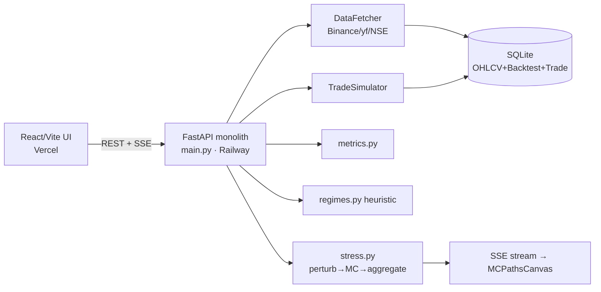
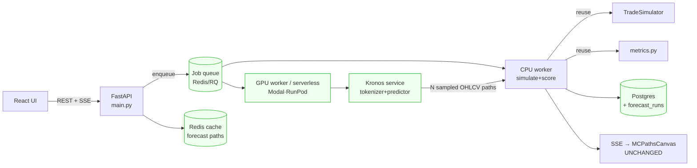
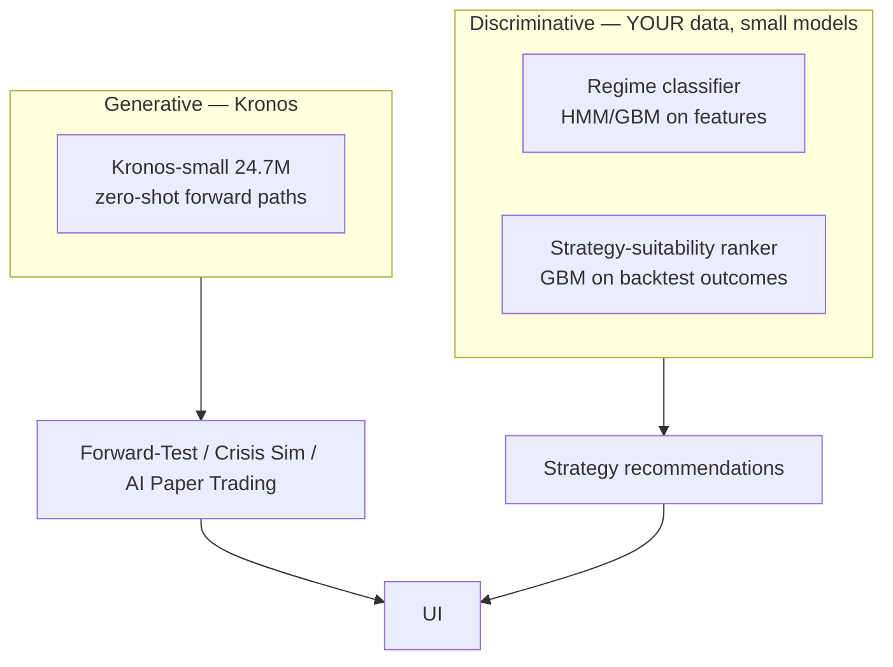

# Kronos × TradeVed — CTO-Level Integration Roadmap

> Brutally honest strategic + technical analysis, grounded in the actual `backtester/` codebase.
> Scope verdict up front: **Kronos is worth integrating for exactly one core capability — probabilistic forward-path generation — which then powers 4 of your 6 founder ideas. The other 2 ideas (regime detection, strategy-intelligence) should NOT use Kronos.** Your real moat is your proprietary backtest-outcomes dataset, not Kronos.

---

## Context — why this document exists

You asked whether to integrate Kronos (an open-source decoder-only foundation model for OHLCV K-lines) into TradeVed, and what the 12-month AI roadmap should be. I read the codebase to ground every recommendation:

- `main.py` (1712 lines) — monolithic FastAPI, **all routes synchronous and blocking**.
- `engine/stress.py` — scenario perturbation + Monte Carlo: `N paths → simulate → aggregate`. This is the natural host for Kronos.
- `engine/regimes.py` — MA-trend+slope heuristic regime labels.
- `engine/simulator.py`, `engine/metrics.py` — the reusable simulate+score core.
- `strategies/base.py` — `generate_signals(df) → df['signal']`. Clean, model-agnostic.
- `database.py` / `models.py` — SQLite + SQLAlchemy; tables: `OHLCVData`, `Backtest`, `BacktestResult`, `Trade`, `AnalyticsEvent`, `Feedback`.
- `requirements.txt` — **no torch, no ML**. Pure pandas/numpy/scipy. Deploy = Railway (backend) + Vercel (frontend).
- Frontend `MCPathsCanvas.tsx` / `StressResults.tsx` — already renders 1000+ equity paths on canvas.

Two hard architectural facts drive everything below:
1. **You have never run a neural net in production.** Adding Kronos = adding PyTorch + GPU serving + a model-ops surface.
2. **Your endpoints block.** Kronos inference is seconds-to-tens-of-seconds. It cannot run inline in a FastAPI request the way `run_backtest` does today. **You need an async job layer before Kronos, regardless of model.**

---

## 1. Executive Summary

| Question you asked | Honest answer |
|---|---|
| Is Kronos actually useful? | **Yes, but narrowly.** One capability matters: generating realistic *probabilistic future OHLCV paths*. Everything valuable (forward-testing, crisis sim, AI paper trading) is that one capability re-skinned. |
| Where's the real competitive advantage? | **AI Forward-Testing + Crisis Simulator** built on Kronos paths, rendered through your *existing* spaghetti-chart UI. No retail competitor (Composer, TrendSpider, QuantConnect) offers generative forward scenarios with a strategy run on top. |
| Where is it overkill? | **Regime detection (Idea 1)** and **Strategy-Intelligence meta-model (Idea 3)**. A 500M-param transformer to label bull/bear, or to rank strategies, is using a jet engine to toast bread. Use your existing heuristic + gradient boosting on your own data. |
| What to build first? | An **async forecast service** (Kronos-small, zero-shot, on serverless GPU) feeding **AI Forward-Test**, which *reuses the entire stress-test path→simulate→aggregate→spaghetti pipeline*. ~2 weeks to a credible demo. |
| Fine-tune? | **No, not yet.** Use as-is (zero-shot) for 3-6 months. LoRA later only if eval proves a gap. Never build your own foundation model — that's startup suicide. |
| Biggest risk? | Spending GPU money + months on a generative model when **your defensibility is the proprietary dataset of {strategy, params, regime, outcome} you are not yet capturing.** Start logging that *this week* — it's free and it compounds. |

**The one-line CTO call:** Integrate Kronos as a *stateless forward-path generator* behind an async job queue, ship AI Forward-Testing as the flagship feature, and treat your backtest-outcomes warehouse — not Kronos — as the moat.

---

## 2. Architecture Analysis

### 2.1 Current system (as built)



**Bottlenecks / gaps relevant to Kronos:**
- All compute is **synchronous in-request** (`run_backtest`, `run_stress`). No queue, no worker pool.
- **SQLite** (single-writer, WAL) — fine now, will not survive concurrent GPU-job writes at 10k users.
- No model artifact store, no GPU, no caching of expensive computed series beyond an in-process `_cache` dict.
- Stress MC paths are **parametric** (`apply_stress` scales/drifts the real curve). Realistic-ish but structurally constrained.

### 2.2 Future system (with Kronos)



**The insight that makes this cheap:** the green boxes are additive. `TradeSimulator`, `metrics.py`, the SSE event shape, and `MCPathsCanvas` are **reused verbatim**. Kronos only replaces *where the candidate price paths come from*.

### 2.3 Data flow — AI Forward-Test (the flagship)

```
fetcher.fetch(symbol, lookback)            # context window (≤512 candles for Kronos-base)
   → validator.validate()
   → KronosClient.forecast(context, horizon=90, n_paths=100, T, top_p)   # GPU service
   → returns N future OHLCV DataFrames
   → for each path: strategy.generate_signals → TradeSimulator.run → calculate_metrics
   → aggregate_stress_results(...)          # REUSE — already exists in stress.py
   → SSE: {baseline, run×N, complete}       # REUSE — same event contract
   → MCPathsCanvas renders                  # REUSE — zero frontend rewrite
```

### 2.4 AI architecture (where models live)



**Key separation:** Kronos = *generative* (make plausible futures). Regime + strategy-intelligence = *discriminative* on *your* tabular data. Do not conflate them; they want different models, infra, and teams.

---

## 3. Kronos Capability Analysis (grounded in the paper/repo)

| Capability | What Kronos actually does | Relevance to TradeVed |
|---|---|---|
| **OHLCV tokenization** | Hierarchical discrete tokens (BSQ-style quantizer) over O/H/L/C(+V). | Internal mechanism; you consume outputs, not tokens. |
| **Autoregressive forecasting** | Decoder-only transformer predicts next tokens → next candles. Variants: mini 4.1M/ctx2048, small 24.7M/ctx512, base 102.3M/ctx512, large 499.2M (proprietary). | **Core value.** This is the engine for forward-testing. |
| **Probabilistic sampling** | Temperature `T` + nucleus `top_p` + `sample_count` → many distinct paths, can be averaged. | **Core value.** Gives you a path *distribution*, not one line → spaghetti chart + probability bands. |
| **Volatility / regime "understanding"** | Emergent — paths exhibit realistic vol clustering. **No explicit regime label, no calibrated vol forecast.** | Weak/indirect. Don't sell "Kronos predicts volatility" — it samples it. |
| **Embeddings** | Hidden states usable as features. | Speculative; low priority vs. your own features. |
| **Synthetic generation** | Continuations conditioned on a context window. **Not** "generate a labeled COVID-variant on demand." | Partial — needs a parametric scaffold (you already have one in `stress.py`). |

### Capability ranking (1 = best)

| Capability | User value | Tech complexity | Comp. advantage | Dev effort | Infra cost | Revenue potential |
|---|---|---|---|---|---|---|
| Probabilistic forward paths | 1 | 2 | 1 | 2 | 3 | 1 |
| Crisis/synthetic scenarios (Kronos+scaffold) | 1 | 3 | 1 | 3 | 3 | 1 |
| Embeddings as features | 4 | 4 | 3 | 4 | 3 | 4 |
| Direct "volatility prediction" | 3 | 3 | 3 | 2 | 3 | 3 |
| Regime detection via Kronos | 4 (overkill) | 4 | 4 | 3 | 4 | 4 |

---

## 4. Founder Feature Validation Matrix

| Idea | Feasible? | Kronos directly? | Extra systems needed | Eng effort | Infra cost | User value | Moat | Verdict |
|---|---|---|---|---|---|---|---|---|
| **1. Regime detection** | Yes | **No — wrong tool** | You already have `classify_regimes`; add HMM/GBM classifier | S | ~0 (CPU) | Med | Low | **Build WITHOUT Kronos.** Improve existing heuristic. |
| **2. AI Forward-Testing** | **Yes** | **Yes** | Async queue + reuse stress pipeline | M | GPU | **High** | **High** | **FLAGSHIP. Build first.** |
| **3. Strategy-Intelligence layer** | Partial | **No** | GBM/meta-model on YOUR backtest outcomes | M | ~0 | High | **Highest (data moat)** | **Build WITHOUT Kronos.** Needs data logging first. |
| **4. Synthetic market replay** | Partial | **Partly** | Kronos + parametric scaffold (`stress.py`) | M-L | GPU | Med-High | Med | Build as extension of #2 + existing stress engine. |
| **5. Crisis simulator** | **Yes** | Partly | Same as #4 + prompt/preset mapping | M | GPU | **High** | High | Build after #2; great marketing surface. |
| **6. AI paper trading** | Yes | Indirectly (paths only) | Real-time paper-trade loop over generated env | L | GPU+state | Med-High | Med | Build last; depends on #2/#5 + paper-trade engine maturity. |

**Brutal note on Ideas 4/5:** "Generate COVID Variant #1/#2/#3 with the *same structural characteristics*" is **not** what Kronos does out of the box. Kronos samples *plausible continuations of a given context*. To get "controlled variants of a named crisis" you need your **existing `stress.py` parametric scaffold** to impose the macro shock shape (depth/duration/vol), and Kronos to make the *micro-structure* realistic. That hybrid is genuinely novel — but it's your stress engine doing the steering, not Kronos.

---

## 5. Opportunity Ranking Matrix (what to build, in order)

| Rank | Feature | ROI rationale |
|---|---|---|
| 1 | **Backtest-outcome logging** (no model) | Free, this week, compounds into the moat + training data for #3 and future fine-tune. |
| 2 | **Async job queue + Postgres migration** | Prerequisite for any GPU work; also fixes current blocking-request scaling. |
| 3 | **AI Forward-Test (Kronos zero-shot)** | Max differentiation per eng-week by reusing stress UI/pipeline. |
| 4 | **Crisis Simulator** (Kronos + scaffold) | High marketing value; reuses #3. |
| 5 | **Strategy-Intelligence ranker** (GBM on your data) | Highest long-term moat; gated on #1 having accumulated data. |
| 6 | **Regime classifier upgrade** | Incremental; supports #5. |
| 7 | **AI Paper Trading** | Highest effort, depends on everything above. |

---

## 6. Infrastructure Cost Analysis

**Principle: never run GPU inference on Railway.** Keep FastAPI/Postgres on Railway; offload Kronos to serverless GPU billed per-second.

| Stage | Users | Kronos serving | DB | Queue | Monthly infra (rough) |
|---|---|---|---|---|---|
| 1 MVP/demo | <100 | Kronos-small **CPU** in a worker, OR Modal serverless T4 on-demand | SQLite→Postgres (Railway) | RQ + Redis (Railway) | **$30–80** |
| 2 Production | ~1k | Modal/RunPod serverless A10/L4, scale-to-zero | Postgres (Railway/Neon) | Redis | **$150–500** |
| 3 | 10k | RunPod/Modal autoscale L4/A10 + aggressive path caching | Postgres (managed, replicas) | Redis cluster | **$1.5k–5k** |
| 4 | 100k | Reserved GPU pool (or Together/Fireworks if Kronos hosted) + CDN-cached common forecasts | Postgres + read replicas + partitioning | Kafka/Redis | **$15k–60k** |

**Provider verdict:**
- **Modal** — best for stage 1-3: scale-to-zero, per-second billing, trivial Python deploy. **Recommended default.**
- **RunPod** — cheapest raw GPU/hr; good once volume is steady.
- **AWS/GCP** — only at stage 4 with reserved capacity; over-engineered before that.
- **Together AI / Fireworks** — only relevant if/when they host Kronos or you serve via a generic LLM endpoint; not today.
- **Hetzner** — great cheap CPU; their GPU supply is thin — fine for the CPU workers, not the GPU path.
- **Railway** — keep for API + Postgres + Redis; **not** for GPU.

**Cost-killers to design in from day 1:** cache forecast paths by `(symbol, interval, context-hash, horizon, T, top_p)` in Redis — popular symbols (BTC, NIFTY50) will hit cache constantly; Kronos-small can run CPU-only at MVP to defer GPU spend entirely.

---

## 7. Fine-Tuning Recommendation

| Option | Cost | Eng effort | Data needed | Expected gain | Risk | Verdict |
|---|---|---|---|---|---|---|
| **A. Use as-is (zero-shot)** | ~0 | S | none | Baseline, likely "good enough" | Low | **CHOOSE NOW** |
| B. LoRA fine-tune | $ (hours of 1 GPU) | M | 10k+ clean symbol-series, eval harness | Marginal-to-moderate on your asset mix | Med (overfit, eval debt) | Revisit in 6 mo |
| C. Continue pretraining | $$$ | L | very large corpus | Uncertain | High | No |
| D. Own foundation model | $$$$$ | XL | massive | Unknown | Startup-ending | **Never** |

**As CTO I choose A now, with a gate to B.** You cannot justify fine-tuning without (1) an eval harness proving zero-shot underperforms on *your* assets (crypto + NSE/BSE), and (2) the clean OHLCV corpus you'd build anyway from `OHLCVData`. Build the eval harness in parallel with the MVP; let *data* decide, not enthusiasm. Note: Indian markets (NSE/BSE) are likely under-represented in Kronos pretraining — if any case justifies LoRA later, it's NSE/BSE, and you have a yfinance pipe to build that corpus.

---

## 8 & 9. Product + Engineering Roadmap (phased, ROI-ordered)

### Phase 1 — 2 weeks: foundation + flagship demo
**Goal: a working AI Forward-Test on one symbol, zero-shot Kronos, reusing the stress UI.**
- **Eng:**
  - Add `engine/forecast.py` with `KronosClient` (HTTP to a Modal/RunPod endpoint; behind `KRONOS_URL` env). Local fallback: load Kronos-small on CPU for dev.
  - Stand up the Kronos service: a thin FastAPI/Modal app loading `Kronos-small` + `Kronos-Tokenizer-base`, exposing `POST /forecast` → N OHLCV paths.
  - New endpoint `POST /api/forecast/run` and `POST /api/forecast/stream` (mirror `run_stress`/`stream_stress_sse`): fetch context via `fetcher.fetch`, validate, call Kronos, then **reuse** `run_single_backtest` + `aggregate_stress_results` per path.
  - Add backtest-outcome logging (Phase-0 of the moat): write `{strategy, params, symbol, regime mix, metrics}` rows on every `run_backtest`.
- **DB:** add `forecast_runs` table (mirror `Backtest`); start the outcomes log table.
- **Infra:** Modal account + one GPU function (scale-to-zero), or CPU-only Kronos-small for the demo.
- **Frontend:** new "Forward Test" page pill in `App.tsx`; point it at `streamStressTest`-style client → render with existing `MCPathsCanvas`.
- **Value:** demoable differentiator. **Risk:** Kronos cold-start latency, NSE realism — mitigate with caching + crypto-first demo.

### Phase 2 — 1 month: production-hardening
- **Eng:** introduce **Redis + RQ** job queue; move forecast + heavy backtests off the request thread. Forecast-path cache keyed by context-hash.
- **DB:** **migrate SQLite → Postgres** (SQLAlchemy already abstracts it; change `DATABASE_URL`, add Alembic).
- **Product:** probability bands (P5/P50/P95) on forecasts; "% of futures where strategy is profitable" verdict — reuse stress verdict logic.
- **Value:** handles concurrency; honest probabilistic framing. **Risk:** Postgres migration of existing data.

### Phase 3 — 3 months: Crisis Simulator + Strategy-Intelligence v1
- **Crisis Simulator:** map `SCENARIO_PRESETS` (you have 17) to a **Kronos+scaffold hybrid** — scaffold imposes shock shape, Kronos fills micro-structure. New `engine/forecast.py` mode. "Show me a flash crash" → preset + generated variants → paper-trade through them.
- **Strategy-Intelligence v1:** train a **gradient-boosting ranker** on the accumulated outcomes log → "this strategy historically degrades in bear/high-vol." **No Kronos.**
- **Regime classifier upgrade:** swap/augment `classify_regimes` heuristic with an HMM or GBM on engineered features (vol, trend, drawdown state).
- **Value:** two moat features. **Risk:** data volume for the ranker — gated on Phase 1 logging.

### Phase 4 — 6 months: AI Paper Trading + eval/fine-tune gate
- **AI Paper Trading:** let users trade *inside* generated/crisis environments; extend the paper-trade engine with a generated-candle feed.
- **Eval harness:** backtest Kronos forecast accuracy on held-out real data (directional + distributional metrics) across crypto + NSE/BSE. **This is the gate for fine-tuning.**
- If eval shows a gap (likely on NSE/BSE): **LoRA fine-tune** on the OHLCV corpus from `OHLCVData`.
- **Value:** unique trader-training product. **Risk:** scope creep on real-time loop.

### Phase 5 — 12 months: scale + defensibility
- Autoscaling GPU, path-cache CDN, Postgres replicas/partitioning.
- Strategy-Intelligence v2: regime-conditional recommendations as a meta-layer above the 70+ indicators.
- Optionally surface Kronos embeddings as features inside the ranker.
- **Value:** compounding data moat. **Risk:** model-ops maturity.

---

## 10. Competitive Analysis

| Platform | What they have | What they LACK that Kronos+TradeVed gives |
|---|---|---|
| **QuantConnect** | Powerful backtesting, real data, LEAN engine | No generative forward scenarios for retail; high skill barrier |
| **Composer** | No-code symphonies, automation | No stress/forward-sim, no probabilistic futures |
| **TrendSpider** | Charting, scanners, some "AI" | No generative path simulation, no crisis sandbox |
| **TradingView** | Charts + community | No backtest-on-generated-futures |
| **Alpaca** | Brokerage/API | Infra, not research intelligence |

**Unique to you (hard to replicate):**
1. **Backtest strategies on AI-generated futures** with a probability verdict — retail-accessible. None of the above ship this.
2. **Crisis Simulator** as a *playable* sandbox (paper-trade through a generated flash crash).
3. **Strategy-suitability intelligence trained on your own users' outcomes** — this is the *truly* defensible one: Kronos is open-source (anyone can use it), but **your {strategy→regime→outcome} dataset is not.** Competitors can copy the feature; they cannot copy the data.

---

## 11. Risk Assessment

| Risk | Severity | Mitigation |
|---|---|---|
| GPU cost balloons | High | Scale-to-zero (Modal), CPU Kronos-small at MVP, aggressive path caching |
| Synchronous API can't host inference | High | Async queue **before** Kronos (Phase 2, but design Phase 1 around it) |
| Statistical validity of "forward-test" oversold | High | Frame as *distribution of plausible futures*, never "prediction"; show P5/P50/P95; document assumptions in UI |
| NSE/BSE realism poor (under-represented in pretrain) | Med | Crypto-first launch; build NSE corpus; LoRA gate in Phase 4 |
| Building Kronos features before capturing moat data | High | Ship outcome-logging in Phase 1 (free) |
| Model-ops with zero prior NN experience | Med | Keep Kronos as an isolated stateless service; treat as a black-box HTTP dependency |
| SQLite under concurrent jobs | Med | Postgres migration in Phase 2 |

**Statistical-validity caveat (read this):** A strategy "passing" on Kronos-generated paths is only as valid as Kronos's distribution matches reality. It is a *stress/robustness* tool, not a profit predictor. Market it honestly as "how does your strategy behave across many plausible futures" — same framing as your existing Monte Carlo, just with a better path generator.

---

## 12. Final CTO Recommendation

1. **Integrate Kronos — narrowly.** One job: generate probabilistic forward OHLCV paths. Use **Kronos-small, zero-shot**, on **Modal serverless GPU** (or CPU at MVP).
2. **Reuse your stress pipeline.** Forward-Test = stress test with the path source swapped. `TradeSimulator`, `metrics.py`, SSE contract, and `MCPathsCanvas` are untouched. This is why ROI is high.
3. **Do NOT use Kronos for regime detection or strategy ranking.** Those are discriminative/tabular problems on *your* data — gradient boosting + your existing heuristic win on cost, latency, and interpretability.
4. **Do NOT fine-tune yet, never build your own foundation model.** Gate fine-tuning behind an eval harness and a real data corpus.
5. **The moat is the data, not the model.** Start logging `{strategy, params, regime, outcome}` in Phase 1 — it's free and it's the one thing competitors can't copy.
6. **Fix the architecture debt Kronos forces you to confront anyway:** async job queue + Postgres. You needed these for scale regardless.

**Sequencing in one line:** *log outcomes → async+Postgres → Kronos forward-test (flagship) → crisis sim → strategy-intelligence on your data → AI paper trading.*

---

## Implementation note (what I'd build first if approved)

Concrete Phase-1 deliverable in this repo, all additive:
- `backtester/engine/forecast.py` — `KronosClient` (HTTP, `KRONOS_URL` env) + `run_forward_test(df, strategy_cls, params, sim_kwargs, capital, horizon, n_paths, T, top_p)` that loops Kronos paths through the **existing** `run_single_backtest` + `aggregate_stress_results`.
- `kronos_service/` — standalone Modal/FastAPI app loading `Kronos-small` + tokenizer, `POST /forecast`.
- `main.py` — add `POST /api/forecast/run` + `POST /api/forecast/stream` (copy the `run_stress`/`stream_stress_sse` structure, swap path source).
- `models.py` — `ForecastRun` table + `StrategyOutcome` logging table; write a `StrategyOutcome` row inside `run_backtest`.
- Frontend — `App.tsx` page pill "Forward Test" reusing `MCPathsCanvas` via a `streamForwardTest()` client in `api.ts`.

### Verification
- Unit: extend `test_all.py` — `KronosClient` returns N DataFrames with OHLCV columns; forward-test output matches stress-result schema (so the frontend renders unchanged).
- Integration: `POST /api/forecast/run` on BTC/USDT, 90-day horizon, 100 paths → assert MC percentile ordering (P5<P50<P95) and equity-path count == n_paths.
- Manual: run backend + frontend, open Forward-Test page, confirm spaghetti chart animates via SSE exactly like the stress page.
- Cost guard: confirm Kronos service scales to zero when idle (Modal dashboard) and Redis cache hit on repeated identical request.
