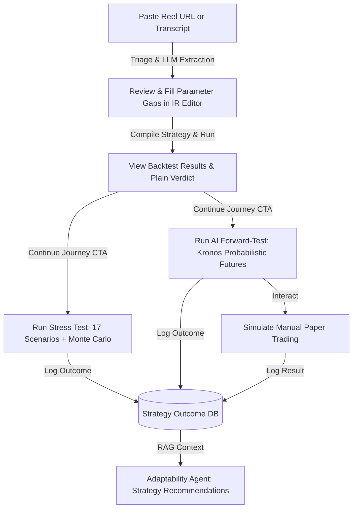

# Product Requirements Document (PRD)
## TradeVed: Quantitative Backtesting and Risk Analytics Platform

---

## 1. Executive Summary & Vision

### 1.1 Product Vision
TradeVed aims to democratize quantitative finance and risk analytics for retail investors, creators, and professionals. The platform bridges the gap between complex quantitative tools and everyday retail trading by providing an intuitive, full-stack backtesting, stress-testing, and AI-powered forward-testing suite. 

TradeVed's unique value proposition is **"Honest Backtesting."** Unlike retail platforms that present a "profit mirage" by ignoring transaction fees, slippage, and market regimes, TradeVed forces reality-checks through itemized tax/cost modeling (e.g., Indian Budget 2024 F&O charges), timeframe-aware regime classification, and probabilistic stress tests.

Furthermore, TradeVed introduces a **Reel-to-Backtest journey**, allowing users to paste social media trading videos (Instagram Reels, YouTube Shorts), extract their rule-based logic automatically via Multimodal LLMs, resolve parameter gaps, and immediately backtest the strategy to verify if the social media claim holds up historically.

### 1.2 Target Audience
*   **Retail Traders & Beginners:** Individuals looking to verify trading strategies they see online without writing code or manually compiling data.
*   **Intermediate System Traders:** Traders seeking realistic backtesting with transaction costs, lot-size rounding, and out-of-sample stress testing.
*   **Finance Creators & Influencers:** Creators wishing to validate their strategies before posting them, establishing credibility.
*   **QA & Engineering Teams:** Cross-functional development teams building and maintaining the platform.

### 1.3 Success Metrics
*   **Conversion Rate (Reel Paste to Run):** Percentage of users who paste a Reel URL and successfully run a backtest.
*   **Strategy Retention Rate:** Percentage of users who save their extracted strategies to their personal library.
*   **Stress-Test Completion Rate:** Percentage of backtests that proceed to a Monte Carlo or scenario stress test.
*   **Platform Reliability:** API latency (<500ms for standard backtests, excluding GPU inference) and SSE streaming connection success (>99.5%).
*   **User Feedback Rating:** Average score submitted via the Feedback Widget (>4.2/5.0).

---

## 2. Problem Statement & User Journeys

### 2.1 The Problem
1.  **The Social Hype Loop:** Short-form videos (Reels, TikToks, Shorts) promote high-win-rate strategies (e.g., "90% Win Rate EMA Strategy"). Retail traders copy these blindly, unaware of transaction costs, slippage, or how they perform in bear markets.
2.  **Unrealistic Simulators:** Most backtesting engines ignore exchange fees, brokerages, stamp duty, and government taxes. For high-frequency or multi-level strategies (like Grid or DCA), these costs can erase all profits.
3.  **Static Backtests (The Profit Mirage):** Standard backtests show a single historical equity curve. They overfit past data and fail when market regimes change. Retail traders lack access to Monte Carlo simulations and forward-looking probabilistic models.
4.  **Siloed Workflows:** Existing tools require users to manual-code in Pine Script or Python, copy parameters between backtest and stress-test views, and maintain external spreadsheets.

### 2.2 Connected Three-Stage User Journey (Integrated Target State)
Instead of fragmented pages, the platform organizes user actions into a continuous funnel:



---

## 3. Current Architecture & Service Topology

The platform deploys as a split client-server architecture:
*   **Frontend:** React 18 SPA built with Vite, TypeScript, and Tailwind CSS. Deployed on Vercel.
*   **Backend:** FastAPI monolith running Python 3.11+, using SQLAlchemy and SQLite for analytics and session storage. Deployed on Railway with a persistent `/data` volume.
*   **AI Inference (GPU):** Modal serverless GPU endpoint hosting `Kronos-small` for probabilistic forecasting.

```mermaid
graph TD
    subgraph Client Layer (Vercel)
        UI[React 18 / Vite / TS SPA]
        Canvas[MCPathsCanvas: HTML5 Canvas]
        Form[StrategyParamsForm / RuleBuilder]
    end

    subgraph API Gateway / Orchestration (Railway)
        API[FastAPI Monolith]
        Fetch[Data Fetcher: yfinance / Binance / CoinGecko]
        Regime[Regime Classifier: Timeframe-Aware]
        DB[(SQLite DB: /data/backtester.db)]
    end

    subgraph Execution Engines
        Sim[Trade Simulator: WACB, Lot-Sizes]
        Cost[Cost Models: Indian Budget 2024 / Simple]
        Stress[Stress Engine: 17 Presets + MC]
        Val[Walk-Forward Validator]
    end

    subgraph AI & Extraction Services
        Extractor[Reel Extractor: Whisper + GPT-Codex]
        Kronos[Modal serverless GPU: Kronos-small]
    end

    %% Communications
    UI -->|HTTPS Requests / SSE Streams| API
    API -->|Fetch & Cache| Fetch
    API -->|Read/Write Session & Logs| DB
    API -->|Executes Backtest| Sim
    Sim -->|Lookup Costs| Cost
    API -->|Generate Scenarios| Stress
    API -->|OOS Validation| Val
    API -->|Transcribe & Extract| Extractor
    API -->|HTTP KRONOS_URL| Kronos
    Stress -->|SSE Stream| Canvas
    Kronos -->|SSE Stream| Canvas
```

---

## 4. Existing Features

### 4.1 Multi-Market Backtester
*   **Supported Markets:** Crypto (Binance & CoinGecko), US Stocks (yfinance), Indian Markets (NSE/BSE).
*   **Three Classic Strategies:**
    1.  **Grid:** Sets grid levels between a price range; buys when crossing down, sells when crossing up.
    2.  **DCA (Dollar Cost Averaging):** Regular interval buys; holds for fixed time or exit target.
    3.  **PLA (Progressive Level Averaging):** Trend crossover (EMA) entry followed by cascading entries on dips, protecting downside with weighted averages.
*   **54 Preset Indicator & Combo Strategies:** Grouped into oscillators, trend indicators, MA variants, volume, breakouts, and composite rules.
*   **Generic Rule Builder:** A visual drag-and-drop builder enabling users to define custom entry/exit rules (e.g., `RSI(14) < 30 AND Close cross_above EMA(50)`) compiled dynamically.
*   **Smart Defaults:** Automatically detects symbol prices and fills appropriate capital, step sizes, and bounds to prevent execution failures.

### 4.2 Stress Tester
*   **17 Scenario Presets:** 13 global market shocks (2008 GFC, COVID 2020 crash, LUNA collapse, whipsaw chop, pump and dump, gap risk) + 4 Indian-specific shocks (2016 Demonetization, Yes Bank Collapse, F&O Gamma Squeeze).
*   **Monte Carlo Simulator:** Runs 100+ simulated paths with per-run magnitude jitter (`severity * uniform(0.75, 1.25)`) and randomized shock offsets to create a path fan.
*   **SSE Streaming:** Streams path metrics in real-time as background threads execute, eliminating browser freezes.
*   **Interactive Spaghetti Canvas:** An HTML5 Canvas component that plots 1000+ paths smoothly, colored dynamically by return (red to teal), supporting hover tooltips, click-to-pin highlighting, and a **Delta Mode** toggle (showing % impact vs. baseline).

### 4.3 AI Forward-Tester (Kronos)
*   **Probabilistic Forecasting:** Seeded with up to 512 historical candles, it queries the serverless Kronos model to generate 100 realistic future paths.
*   **Local Circular Block Bootstrap:** A zero-cost fallback generator that preserves autocorrelation structures, ensuring the feature works seamlessly when KRONOS_URL is not set.
*   **Crisis Sim Integration:** Overlays macro stress shapes on Kronos-generated micro-structures.
*   **Simulated Paper Trading:** An interactive viewport where users manual-trade bar-by-bar against a generated future, testing their performance in real-time.

### 4.4 Strategy Outcome Logger
*   An append-only database logger (`models.StrategyOutcome`) that saves `{strategy, params, symbol, source, regime_mix, outcome_metrics}` on every backtest. This serves as the data foundation for future AI strategy recommendation models.

---

## 5. Work-in-Progress & Current Blockers

### 5.1 Blocker 1: Instagram URL Ingestion (P0)
*   **Status:** Work-in-Progress / Blocked.
*   **Problem:** Instagram requires authenticated session cookies to allow video downloads via `yt-dlp`. Running in headless cloud environments (Railway) leads to HTTP 403 / 451 errors, preventing URL extraction.
*   **Fallback Solution (Shipped):** The UI provides a "Pasted Transcript" tab where users can copy/paste raw transcript text. Apify instagram-scraper integration serves as a secondary, credit-based fallback.
*   **Required Technical Fix:** Implement static cookie injection. Backend engineers must export a `cookies.txt` file from an authenticated browser, save it to the Railway persistent volume mount (`/data/instagram_cookies.txt`), and inject the `--cookies` parameter in `yt-dlp` execution.

### 5.2 Blocker 2: LLM Thread Blocking (P1)
*   **Status:** Open Debt.
*   **Problem:** Triage and extraction calls to the LLM (Azure OpenAI) run synchronously within the FastAPI request handler, blocking the main thread for 3–8 seconds. Under concurrent load, the entire backend becomes unresponsive.
*   **Required Technical Fix:** Move processing to a Redis + RQ job queue. The endpoint `/api/reel/analyze` should return a `task_id` immediately. The frontend will poll `/api/reel/task/{task_id}` or connect via SSE to monitor progress.

### 5.3 Work-in-Progress: CustomStrategy Indicator Alignment (P2)
*   **Status:** Active Bug.
*   **Problem:** When evaluating custom crossover rules (e.g., EMA(9) crossing EMA(21)), different indicator warm-up periods (9 vs. 21 bars) lead to NaN-mismatches in pandas series. This causes boolean masks to resolve to all `False` values, returning 0 trades with no errors.
*   **Required Technical Fix:** Standardize index alignment in `CustomStrategy._evaluate_side()` by calling `.dropna()` and `.reindex(df.index)` before performing bitwise operations.

---

## 6. Functional & Business Logic Requirements

### 6.1 Transaction Cost Modeling
To prevent unrealistic backtests, every simulated trade must apply the correct cost model.

#### Indian Market Cost Model (Budget 2024 Rates)
Applicable if symbol source is `nse` or `bse`, or if symbol auto-detects as Indian (e.g., `RELIANCE`, `NIFTY50`). Costs are calculated per leg and logged in detail:
*   **Equity Delivery:**
    *   Brokerage: Flat / % based.
    *   Securities Transaction Tax (STT): 0.1% on buy leg AND 0.1% on sell leg.
    *   GST: 18% applied on the sum of (Brokerage + Exchange Transaction Charges + SEBI turnover fees).
*   **Equity Intraday:**
    *   STT: 0.025% on sell leg only.
*   **Futures:**
    *   STT: 0.02% on sell leg only.
    *   Lot-size enforcement.
*   **Options:**
    *   STT: 0.1% applied on the sell leg premium value.
    *   Lot-size enforcement. P&L calculated on underlying index movement.

#### Simple Cost Model
Used for Crypto and US Stocks:
*   Applies a flat percentage fee per leg (defaults: 0.1% for Crypto, 0.05% for US Stocks), representing combined exchange fee, broker commission, and average slippage.

### 6.2 Simulator Logic & Constraints
*   **Weighted Average Cost Basis (WACB):** For strategies that scale into positions (like PLA and Grid), average entry price must adjust dynamically:
    $$\text{New Avg Price} = \frac{(\text{Current Qty} \times \text{Current Avg Price}) + (\text{Added Qty} \times \text{Execution Price})}{\text{Current Qty} + \text{Added Qty}}$$
*   **Lot-Size Rounding:** For Futures and Options, order quantity must round down to the nearest lot multiplier:
    $$\text{Filled Qty} = \lfloor \frac{\text{Requested Qty}}{\text{Lot Size}} \rfloor \times \text{Lot Size}$$
    If Filled Qty reaches 0 because the requested amount is smaller than 1 lot, the trade is skipped. A counter `lot_size_skips` increments.
*   **Capital Sufficiency Checks (Pre-flight):** Before running F&O backtests, the UI checks if capital is sufficient to purchase at least one lot:
    $$\text{Capital} \ge \text{Lot Size} \times \text{Approx Price} \times 1.05$$
    If capital is insufficient, the system prevents execution and provides a guided warning.

### 6.3 Regime Detection
*   **Timeframe-Aware Classification:** Labels market blocks as `bull`, `bear`, or `sideways` based on Exponential Moving Averages (EMA). 
*   Rather than fixed candle counts, MA windows scale dynamically based on the candle interval (e.g., daily vs. 4-hour) using calculated bars per day, ensuring structural agreement of regime mixes across intervals.

---

## 7. Product Integration Requirements & User Flows

To transition from siloed pages to a unified funnel, the following product integrations are required:

### 7.1 Shared Strategy Context
*   **Requirement:** A global strategy context must persist on the client. If a user loads or creates a strategy on one page, they must not repeat setup steps when navigating elsewhere.
*   **User Flow:**
    1.  User extracts a strategy from a Reel.
    2.  User runs the backtest.
    3.  A persistent nav pill shows `PLA [EMA 9-21] on NIFTY50`.
    4.  User clicks the **Stress Test** tab. The sidebar is pre-populated with `PLA [EMA 9-21]`, `NIFTY50`, and capital settings from the backtest.
    5.  User clicks **Forward Test**. Parameters persist.

### 7.2 Regime-Aware Stress Scenarios
*   **Requirement:** Connect backtest output to stress-testing. If the backtest shows a strategy underperforms in a specific regime, the platform should recommend relevant stress scenarios.
*   **User Flow:**
    1.  Backtest runs and identifies that 65% of the backtest period was in a `bear` regime.
    2.  User navigates to the Stress page.
    3.  The Stress Sidebar displays a highlighted section: **"Suggested Scenarios for Bearish Tendency: [Slow Bleed Bear], [2008 GFC Replay]"**.

### 7.3 Plain Language Verdicts
*   **Requirement:** Standardize plain-language verdict cards across all pages, translating math metrics (Sharpe, Sortino, Max Drawdown) into clear investor advice.
*   **Sample Verdict Rules:**
    *   `Return < Buy & Hold Return`: *Verdict: Underperforming.* "This strategy earned +12%, but simply holding the index would have returned +18%. You took active risk to make less money."
    *   `Max Drawdown > 25%`: *Verdict: High Volatility Risk.* "You made +30%, but experienced a -32% drawdown. Ensure you have the emotional capacity to avoid panic-selling during deep drawdowns."
    *   `Sharpe Ratio < 1.0`: *Verdict: Inefficient.* "The returns generated do not sufficiently compensate for the price fluctuations experienced."

---

## 8. Non-Functional Requirements

### 8.1 Performance & Latency
*   **Backtest Execution:** A standard 2-year daily backtest should complete in <300ms.
*   **Canvas Redrawing:** Canvas rendering must operate at 60 FPS, utilizing incremental drawing refs (`drawnCountRef`) to add new Monte Carlo paths without clearing the canvas.
*   **Inference Timeouts:** Since Kronos GPU cold-starts can take up to 2 minutes, HTTP client timeouts on backend calls to the GPU service must be set to 300 seconds.

### 8.2 Reliability & Scalability
*   **Database Concurrency:** Enable WAL (Write-Ahead Logging) on SQLite to prevent locking during simultaneous backtest saves and outcome logging.
*   **CORS & Proxying:** Vite configurations must support infinite proxy timeouts (`timeout: 0, proxyTimeout: 0`) to prevent proxy terminations during streaming SSE responses.

---

## 9. Security & Compliance
*   **No Code Injection:** The rule builder must evaluate rule trees deterministically via a structured AST (Abstract Syntax Tree) in `strategies/custom.py`. Under no circumstances should backend code execute arbitrary string commands (`eval` or `exec`).
*   **Admin Gatekeeper:** The admin dashboard must remain token-gated. The frontend must extract the token from query parameters, store it in local storage, and immediately clear it from the address bar to prevent exposure in shared screenshots.
*   **Financial Disclaimers:** All results pages must display standard disclaimers stating that historical backtesting does not guarantee future results, and that the platform is for educational purposes only.

---

## 10. Release Milestones & Roadmap

```
Phase 1: Journey Integration (Target: Week 1)
  - Pre-flight lot-size checks & capital warning
  - Global Strategy Context in React frontend
  - Mount Instagram cookies on Railway volume
  - Plain Language Verdict on Backtest results

Phase 2: Platform Robustness (Target: Week 2)
  - RQ Redis queue integration for LLM calls
  - SQLite to Postgres migration
  - CustomStrategy crossover bug fix
  - Suggest stress scenarios based on backtest regimes

Phase 3: AI Extensions (Target: Week 3-4)
  - HMM model for regime classifier upgrade
  - Strategy-Intelligence suitability ranker
  - Shareable card exporter (Canvas image)
  - Paper trade results logged to outcome database
```
