<div align="center">

# 📈 TradeVed — Backtester & Risk Analytics

### A full-stack quantitative backtesting, stress-testing & AI-forecasting platform for Crypto, US Stocks and Indian Markets (NSE/BSE)

[](https://python.org)
[](https://fastapi.tiangolo.com)
[](https://react.dev)
[](https://typescriptlang.org)
[](https://tailwindcss.com)
[](backtester/test_all.py)

*Backtest 55+ strategies. Stress them through 17 historical crises. Forecast them with a GPU foundation model. Grade them A+ → F on robustness. Even turn an Instagram trading reel into a verified backtest.*

</div>

---

## 🎬 The Platform in Action

### Backtester — every metric a quant would ask for, at a glance

The moment a run finishes you get 14 headline metrics (Sharpe, Sortino, Calmar, profit factor, best/worst trade…) **plus a per-regime breakdown**: the same strategy scored separately inside the bull, bear and sideways segments of your date range, so you instantly see whether returns came from skill or from one lucky regime.

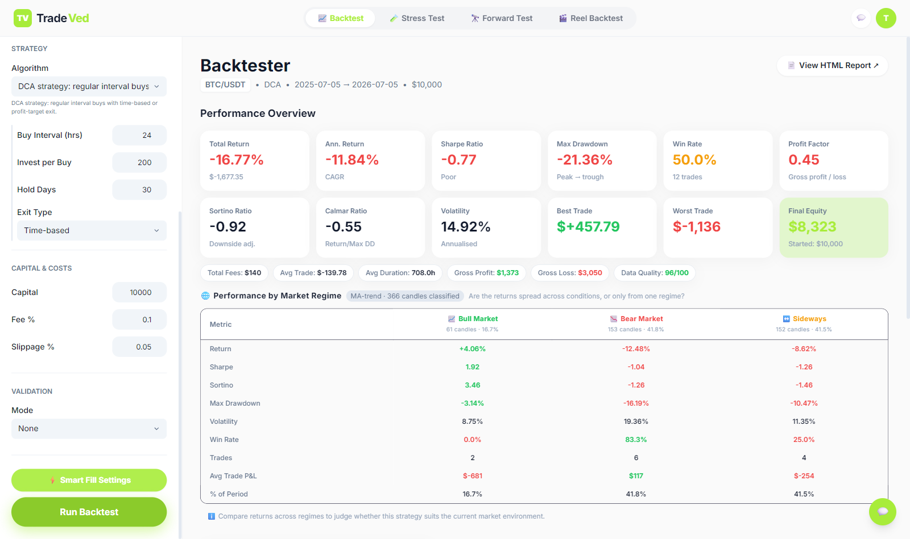

Equity curves are painted over **regime-shaded backgrounds** (green = bull, red = bear, amber = sideways), with tabs for drawdown, return distribution, price + trade markers, monthly P&L heatmap and rolling metrics:

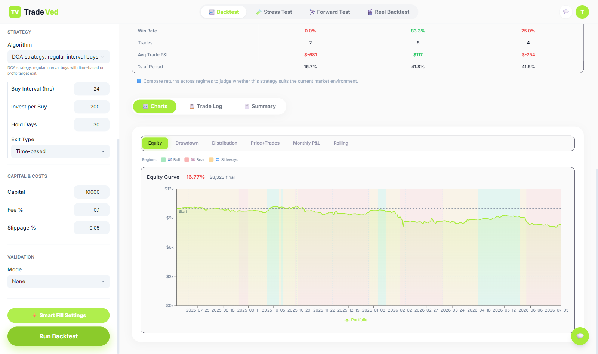

### Stress Tester — an A+ → F Robustness Score for any strategy

Pick a crisis (2008 GFC, COVID flash crash, LUNA-style collapse, Yes Bank 2020…), pick a severity, and the engine replays your strategy through 100+ Monte Carlo perturbations of that crisis — **streamed live over Server-Sent Events** so you watch the distribution build in real time. The verdict card grades the strategy across scenario survival, MC stability, tail safety (CVaR / Expected Shortfall, probability of ruin) and overfit resistance:

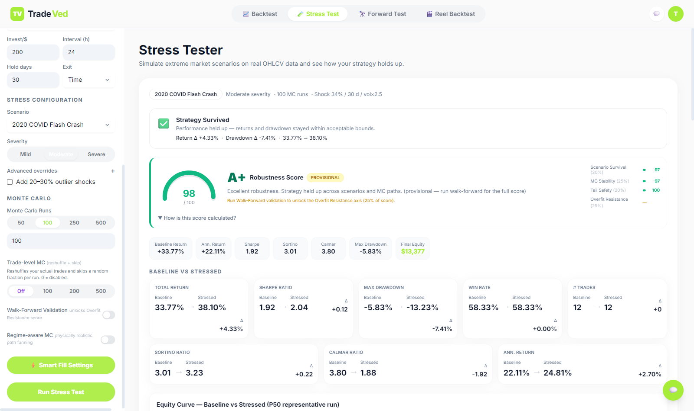

Every simulated path lands on a raw-canvas spaghetti chart (handles 1000+ paths — hover to inspect, click to pin, toggle absolute vs delta-vs-baseline), with P5/P50/P95 percentile cards and a sortable run log:

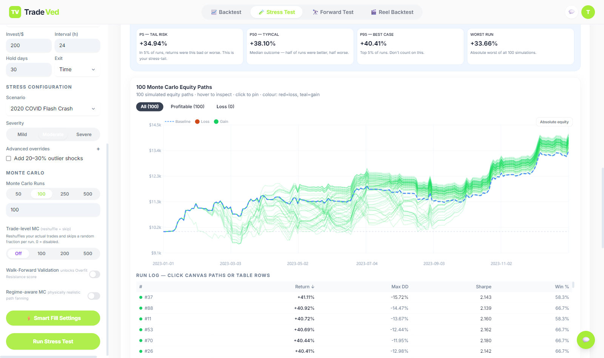

### AI Forward Test — the distribution of plausible futures

Instead of asking *"how did this strategy do last year?"*, the Forward Test asks *"how will it do across 100 synthetic futures?"* — generated either by circular block-bootstrap (autocorrelation-preserving) or by the **Kronos time-series foundation model running on a GPU via Modal**. You get a regime forecast, a survival rate, and full outcome distributions. Two more modes — **Crisis Sim** (stress + generated paths) and **Paper Trade** (bar-by-bar simulation) — live on the same page:

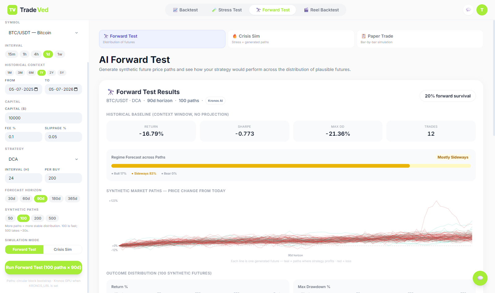

### Reel Backtest — from influencer hype to hard numbers

Paste the transcript (or URL) of any trading reel. An LLM extracts the claimed strategy into a strict intermediate representation, a validator sanity-checks it, the real engine backtests it, and a plain-language verdict tells a complete novice whether "this prints money every time" actually survived the data:

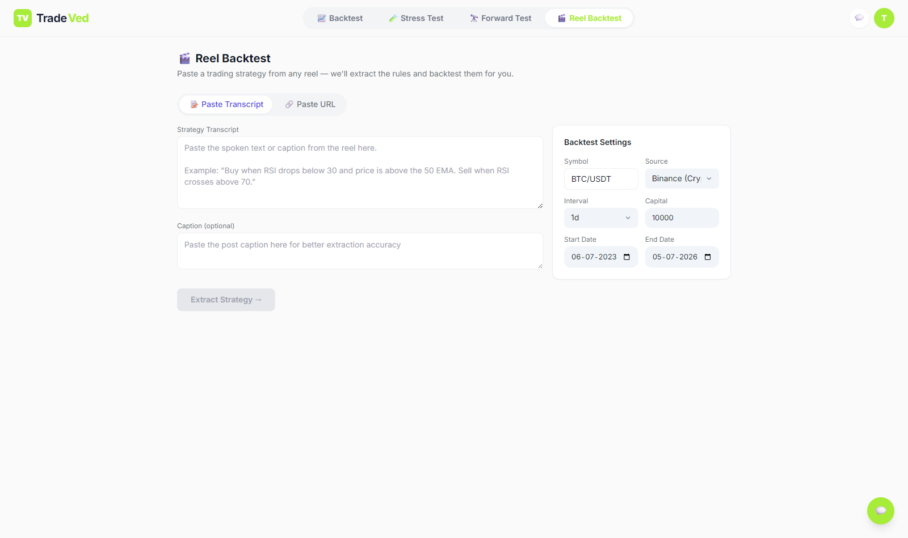

---

## 🏆 Why This Project Stands Out

| | |
|---|---|
| 🇮🇳 **Real Indian market economics** | Itemised STT, exchange charges, SEBI fees, GST, stamp duty at **Budget 2024 rates** — plus F&O **lot-size enforcement** (NIFTY50 = 50, BANKNIFTY = 15…). Most backtesters fake this with a flat fee; this one refuses to place a sub-lot futures order, exactly like a real broker. |
| 💥 **Crisis-grade stress testing** | **17 scenario presets** — 13 global + 4 India-specific (Demonetization 2016, COVID NIFTY, Yes Bank collapse, F&O expiry gamma squeeze) — with mild/moderate/severe calibration, optional 20–30% outlier injection, trade-level MC (reshuffle + random skip) and regime-aware path fanning. |
| 🎯 **One-number verdicts** | The **Robustness Score (A+ → F)** compresses scenario survival, MC stability, tail safety (CVaR/ES, probability of ruin) and walk-forward overfit resistance into a single score a non-quant can act on. |
| 🤖 **AI strategy extraction from social media** | Reel transcript → LLM → validated strategy IR → real backtest → plain-language verdict. Validated at scale across 100+ real reels. |
| 🔮 **Foundation-model forecasting** | Kronos (GPU, deployed on Modal) generates synthetic futures with concurrent batching — 100 paths in ~2 s — benchmarked against classical block-bootstrap. |
| 🧱 **55+ strategies, zero-code extensibility** | 3 classic strategies + 52 indicator presets (including 20 two-indicator confirmations like *Supertrend + RSI*, *MACD + ADX*) + a visual rule builder. Strategies self-describe their parameters, so a new one needs **zero frontend changes**. |

---

## 🧭 How It Works — Core Workflows

### 1. Backtest pipeline

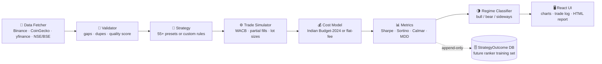

Every backtest also quietly appends an outcome row (strategy, params, symbol, regime mix, metrics) to a `StrategyOutcome` table — the seed dataset for a future strategy-recommendation ranker.

### 2. Stress test — live SSE streaming

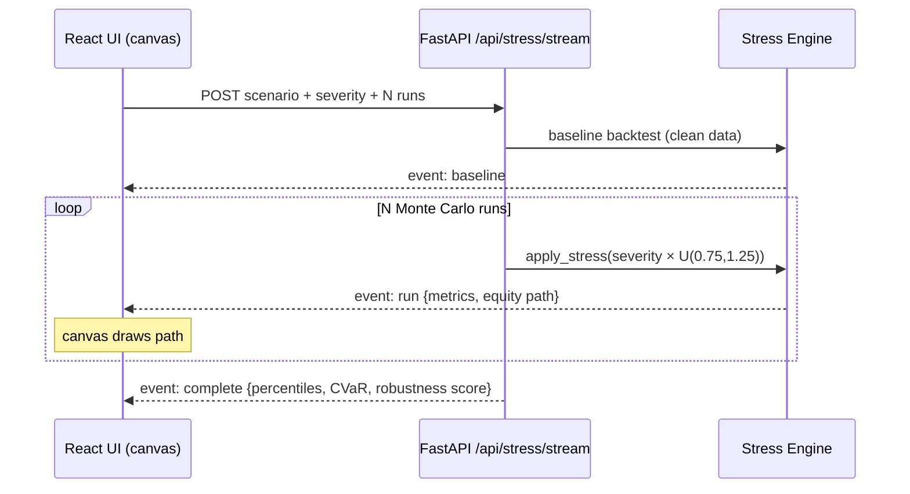

Two details judges usually ask about: **(a)** each run jitters both shock *timing* and *magnitude*, so paths fan out realistically instead of collapsing onto one line; **(b)** crash scenarios use *persistent* drift — prices don't magically snap back after the crash window, which would otherwise gift the strategy free buy-low-sell-high profits.

### 3. Reel → Backtest (AI pipeline)

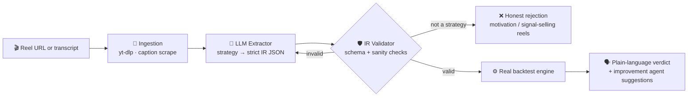

The IR editor in the UI lets power users inspect and tweak the extracted rules before running — so the LLM proposes, but the deterministic engine always disposes. A deterministic **normalizer** auto-repairs known LLM output drift before validation — whole rules emitted as DSL strings (`"rsi(14) < 30"`), misnamed keys, nested operand wrappers, and mis-cased symbol/source suggestions (`BTCUSD`/`BINANCE` → `BTC/USDT`/`binance`) — all reproduced from live runs and covered by unit tests.

### 4. Unified Pipeline — one-click orchestrator (🔁 Full Pipeline tab)

The newest surface: paste a transcript and the server runs the *entire* research loop as a resumable state machine, with one human checkpoint.

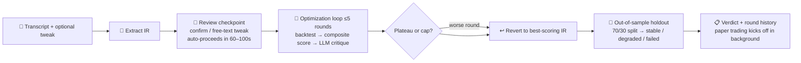

Engineering details worth noting: runs survive backend restarts (a sweep loop detects orphaned tasks and marks them resumable); the browser survives refreshes (run id persisted client-side, polling resumes); the checkpoint is a real timer, not a modal — walk away and the pipeline proceeds with the extracted strategy; and if an LLM "improvement" round *regresses* the composite score, the pipeline reverts to the best-scoring strategy before the holdout so the final verdict always describes the best round, not the last one.

### 5. AI Forward Test

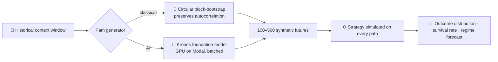

---

## ✨ Feature Tour

### Backtester
- **Strategies:** GRID (price-level laddering), DCA (interval accumulation), PLA (EMA crossover + cascading average-down), **52 indicator presets** — momentum (RSI, Stochastic, CCI, Williams %R, ROC, TSI…), trend (ADX, PSAR, Aroon, SMA/WMA/HMA/Triple-EMA crosses, Golden Cross…), volume (VWAP, OBV, MFI, CMF), volatility (Keltner, ATR breakout, Bollinger squeeze) and 20 two-indicator confirmation combos — plus a fully **custom rule builder** (AND/OR condition trees over the indicator engine)
- **Markets:** Crypto (Binance/CoinGecko), US stocks (yfinance), Indian NSE/BSE equity delivery & intraday, futures and options with real lot sizes
- **Simulator:** weighted-average cost basis, partial fills when cash runs short, lot-size flooring with skip diagnostics, slippage modelling
- **Validation modes:** hold-out and **walk-forward** (rolling in-sample/out-of-sample windows) selectable per run
- **Regime intelligence:** timeframe-aware bull/bear/sideways classification — the same period labelled consistently whether you test on 4h or 1d candles — driving per-regime metric tables and shaded charts

### Stress Tester
- 17 presets across four families: historical replays (GFC, COVID, flash crashes), structural regimes (slow bleed, whipsaw, liquidity drought), manipulation patterns (pump & dump, gap risk) and India-specific events
- **Robustness Score** with transparent axis weights: scenario survival 30% · MC stability 25% · tail safety 20% · overfit resistance 25%
- Tail-risk analytics: CVaR / Expected Shortfall, probability of ruin, P5/P50/P95 outcome cards
- Optional **trade-level Monte Carlo** (reshuffles executed trades and randomly skips a fraction per run) and **regime-aware MC** for physically plausible path fanning

### AI & Forecasting
- **Kronos** foundation-model price forecasting served from Modal with concurrent batch generation (100 paths ≈ 2 s)
- **Crisis Sim** (stress scenarios on generated futures) and **Paper Trade** (bar-by-bar forward simulation) modes
- Reel → Backtest pipeline with confidence scoring, honest rejection of non-testable reels, and an AI improvement agent that **actually re-runs** the improved strategy and shows an original-vs-improved diff table audited by a judge LLM — no fabricated numbers
- **Unified Pipeline orchestrator:** transcript → extraction → human checkpoint (60–100s auto-proceed) → ≤5-round optimize-critique loop with best-IR revert → out-of-sample holdout → verdict, resumable across backend restarts and browser refreshes

---

## 📊 Sample Results (Jan 2022 → Jan 2024)

**Crypto — $10,000 per symbol, 432 optimization runs**

| Symbol | Best Strategy | Return |
|--------|--------------|-------:|
| SOL/USDT | DCA (daily, profit-exit 10%) | **+441%** |
| BTC/USDT | DCA | +159% |
| BNB/USDT | DCA | +73% |
| ETH/USDT | DCA | +65% |

*Why DCA dominates crypto: crash-then-recover markets reward accumulating through the lows — SOL crashed 95% during FTX and the strategy kept buying.*

**Indian F&O — real lot sizes & Budget-2024 costs, 792 runs**

| Symbol | Best Strategy | Return | Sharpe | Max DD |
|--------|--------------|-------:|-------:|-------:|
| HDFCBANK | PLA EMA 12/26 | +31.1% | 1.14 | −12.2% |
| BANKNIFTY | PLA EMA 9/21 | +30.8% | 1.33 | −14.4% |
| INFY | PLA EMA 9/21 | +20.4% | **1.62** | −4.6% |
| RELIANCE | GRID 5-level exp. | +6.1% | 1.56 | −1.5% |

**Stress validation — 207 automated tests** (13 scenarios × 3 strategies × 3 assets × severities): LUNA-style collapse is the most dangerous scenario (median −11.8%); DCA and GRID actually *improve* through GFC-style crashes by accumulating the dip — exactly the kind of non-obvious insight the platform exists to surface.

---

## 🚀 Quick Start

```bash
git clone https://github.com/HarshitK2814/Backtester-and-Risk-Analytics.git
cd Backtester-and-Risk-Analytics

# Backend
python -m venv venv && source venv/bin/activate   # Windows: venv\Scripts\activate
pip install -r backtester/requirements.txt
cp backtester/.env.example backtester/.env         # all keys optional — runs on Binance/yfinance without any
cd backtester && python main.py                    # FastAPI on :8000

# Frontend (second terminal)
cd backtester/frontend
npm install && npm run dev -- --port 5173          # UI on :5173
```

- **UI:** http://localhost:5173 · **Swagger:** http://localhost:8000/docs

Run the test suites:

```bash
cd backtester
python -m pytest test_all.py -v        # 37 unit/integration tests
python stress_validation.py           # 207 stress-scenario validations (backend must be running)
```

---

## 🗂️ Repo Map

```
backtester/
├── main.py                 # FastAPI app — all routes, SSE streaming, orchestration
├── engine/
│   ├── simulator.py        # WACB trade simulator, partial fills, lot sizes
│   ├── cost_models.py      # IndianCostModel (Budget 2024) + SimpleCostModel
│   ├── indicators.py       # 25-indicator pure pandas/numpy engine (40 output series)
│   ├── metrics.py          # Sharpe / Sortino / Calmar / MDD / PF
│   ├── regimes.py          # Timeframe-aware regime detection
│   ├── validation.py       # Hold-out & walk-forward validation
│   └── stress.py           # 17 scenario presets, MC aggregation, robustness scoring
├── strategies/             # GRID · DCA · PLA · 52 indicator presets · rule-builder
├── orchestrator/           # Unified pipeline: stages, task runner, checkpoint sweep, cache
├── data/                   # Binance / CoinGecko / yfinance fetchers, NSE/BSE assets
├── reel_extractor.py       # Reel transcript → strategy IR (LLM) + suggestion normalization
├── ir_validator.py         # IR schema validation + deterministic LLM-drift auto-repair
├── improvement_agent.py    # AI strategy-improvement suggestions
├── ingestion.py            # Reel/video ingestion (yt-dlp, captions)
├── test_all.py             # 44-test pytest suite (+16 normalizer/suggestion/orchestrator tests alongside)
├── stress_validation.py    # 207-test stress validation
└── frontend/               # React 18 + Vite + TS + Tailwind
    └── src/components/     # Canvas MC charts, RuleBuilder, StressPage, ReelPage…
kronos_service/             # Kronos foundation-model forecasting (Modal deployment)
docs/screenshots/           # The screenshots used in this README
```

Deeper dives: [ARCHITECTURE.md](ARCHITECTURE.md) · [TECHNICAL_DOCUMENTATION.md](TECHNICAL_DOCUMENTATION.md) · [USER_GUIDE.md](USER_GUIDE.md) · [PRD.md](PRD.md) · [ROADMAP.md](ROADMAP.md)

---

## 🧠 Engineering Highlights (for the technically curious judge)

- **Correctness over convenience:** cost tracking uses a two-phase `track=True/False` protocol so partial fills never double-count fees; crash scenarios use persistent drift so prices don't snap back and mint fake profits; win-rate units are enforced end-to-end (a classic source of "5769%" bugs elsewhere).
- **Performance where it matters:** the SSE endpoint offloads every blocking backtest to `asyncio.to_thread` so events flush between iterations; the MC chart is raw Canvas with incremental drawing and devicePixelRatio scaling — the previous SVG chart died at ~100 paths, this one handles 1000+; Kronos inference is batched and dispatched concurrently (100 paths ≈ 2 s).
- **Extensibility by design:** strategies self-describe via `parameter_schema()` and the frontend renders forms from `/api/strategies` — the 52 indicator presets shipped with **zero** frontend changes.
- **No fragile TA dependencies:** every indicator implemented from scratch in pure pandas/numpy, with SMA-seeded Wilder smoothing that matches textbook RSI/ATR/ADX values (verified in tests).
- **Tested like a product, not a demo:** 60+ unit/integration tests (core engine, IR normalizer drift cases, suggestion coercion, orchestrator loop/holdout logic) + a 207-combination automated stress-validation matrix, plus recorded live E2E passes through the real UI with real LLM and market data.
- **LLM output treated as untrusted input:** every shape of extraction drift observed in live runs (string rules, key renames, nested operands, mis-cased symbols) gets a deterministic auto-repair with a regression test — the model proposes, the validator disposes.

---

<div align="center">

**Built by [Harshit Kumar](https://github.com/HarshitK2814)**

*If this project impressed you, a ⭐ would make my day.*

</div>
