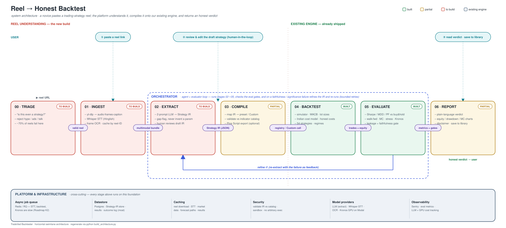

<div align="center">

# 📈 TradeVed — Backtester & Risk Analytics

### A full-stack quantitative backtesting, stress-testing & AI-forecasting platform for Crypto, US Stocks and Indian Markets (NSE/BSE)

[](https://python.org)
[](https://fastapi.tiangolo.com)
[](https://react.dev)
[](https://typescriptlang.org)
[](https://tailwindcss.com)
[](backtester/test_all.py)

*Backtest any strategy. Stress it through 17 historical crises. Forecast it with AI. Even turn an Instagram trading reel into a verified backtest.*

</div>

---

## 🏆 Why This Project Stands Out

| | |
|---|---|
| 🇮🇳 **Real Indian market economics** | Itemised STT, exchange charges, SEBI fees, GST, stamp duty at **Budget 2024 rates** — plus F&O **lot-size enforcement** (NIFTY50 = 50, BANKNIFTY = 15…). Most backtesters fake this with a flat fee. |
| 💥 **Crisis-grade stress testing** | **17 scenario presets** — GFC 2008, COVID crash, LUNA collapse, pump & dump… plus 4 India-specific ones (Demonetization 2016, Yes Bank collapse, F&O expiry gamma squeeze) — replayed as Monte Carlo simulations **streamed live over SSE** onto a canvas "spaghetti" chart that handles 1000+ paths. |
| 🤖 **AI strategy extraction from social media** | Paste an Instagram reel / YouTube transcript → an LLM extracts the strategy into a validated intermediate representation (IR) → it runs on the real engine → a **plain-language verdict** tells a novice whether the influencer's strategy actually works. |
| 🔮 **Kronos AI price forecasting** | Foundation-model time-series forecasting (Kronos) deployed on Modal, with concurrent batched path generation (100 paths ≈ 2 s) compared against classical bootstrap. |
| 🧱 **No-code strategy builder** | 25 indicators (40 output series) in a pure pandas/numpy engine + a visual rule builder (`cross_above`, `cross_below`, AND/OR logic) — new strategies need **zero frontend changes** thanks to schema-driven forms. |

---

## 🖼️ Architecture



```
React 18 + Vite + TS ──► FastAPI (async, SSE) ──► Strategy Engine ──► Trade Simulator (WACB, partial fills, lot sizes)
        │                       │                      │                     │
   Canvas MC charts        SQLite (outcomes)      25-indicator         Cost models (Indian
   Rule builder UI         Kronos @ Modal         pure-pandas engine   Budget-2024 / flat-fee)
```

---

## ✨ Feature Tour

### 1️⃣ Backtester
- **Strategies:** GRID (price-level laddering), DCA (interval accumulation), PLA (EMA crossover + cascading average-down), 6 indicator presets (RSI, MACD, Bollinger, Supertrend, Donchian, MA-Cross), and fully **custom rule-built strategies**
- **Markets:** Crypto (Binance / CoinGecko), US stocks (yfinance), Indian NSE/BSE equity, futures & options
- **Simulator:** Weighted-average cost basis, partial fills when cash is short, lot-size flooring with skip diagnostics
- **Metrics:** Sharpe, Sortino, Calmar, max drawdown, profit factor, win rate — annualised over 252 trading days
- **Regime detection:** timeframe-aware bull / bear / sideways labelling, so a 4h and a 1d backtest of the same period agree
- **Validation:** walk-forward, out-of-sample, Monte Carlo, stress testing

### 2️⃣ Stress Tester
- Pure-function scenario engine (`apply_stress`) — deep-copies data, never mutates, **persistent drift** so crashes don't snap back into fake profits
- Per-run severity jitter (`severity × U(0.75, 1.25)`) so Monte Carlo paths fan out realistically in both timing *and* magnitude
- **Live SSE streaming**: baseline → run × N → complete, rendered incrementally on a high-DPI canvas with hover, click-to-pin and a delta-vs-baseline mode

### 3️⃣ Reel → Backtest (AI pipeline)
- Transcript ingestion → LLM extraction → **IR validator** (schema + sanity checks) → engine execution → plain-language verdict + improvement suggestions
- Validated at scale: 100+ real reels processed end-to-end

### 4️⃣ Strategy Intelligence (moat seed)
- Every backtest appends a `StrategyOutcome` row (strategy, params, symbol, regime mix, outcome metrics) — the training set for a future strategy ranker

---

## 📊 Sample Results (Jan 2022 → Jan 2024)

**Crypto — $10,000 per symbol, 432 optimization runs**

| Symbol | Best Strategy | Return |
|--------|--------------|-------:|
| SOL/USDT | DCA (daily, profit-exit 10%) | **+441%** |
| BTC/USDT | DCA | +159% |
| BNB/USDT | DCA | +73% |
| ETH/USDT | DCA | +65% |

**Indian F&O — real lot sizes & Budget-2024 costs, 792 runs**

| Symbol | Best Strategy | Return | Sharpe | Max DD |
|--------|--------------|-------:|-------:|-------:|
| HDFCBANK | PLA EMA 12/26 | +31.1% | 1.14 | −12.2% |
| BANKNIFTY | PLA EMA 9/21 | +30.8% | 1.33 | −14.4% |
| INFY | PLA EMA 9/21 | +20.4% | **1.62** | −4.6% |
| RELIANCE | GRID 5-level exp. | +6.1% | 1.56 | −1.5% |

**Stress validation — 207 tests (13 scenarios × 3 strategies × 3 assets × severities)**: LUNA-style collapse is the most dangerous scenario (median −11.8%); DCA/GRID actually *improve* through GFC-style crashes by accumulating the dip.

---

## 🚀 Quick Start

```bash
git clone https://github.com/HarshitK2814/Backtester-and-Risk-Analytics.git
cd Backtester-and-Risk-Analytics

# Backend
python -m venv venv && source venv/bin/activate   # Windows: venv\Scripts\activate
pip install -r backtester/requirements.txt
cp backtester/.env.example backtester/.env         # all keys optional — runs on Binance/yfinance without any
cd backtester && python main.py                    # FastAPI on :8000

# Frontend (second terminal)
cd backtester/frontend
npm install && npm run dev -- --port 5173          # UI on :5173
```

- **UI:** http://localhost:5173 · **Swagger:** http://localhost:8000/docs

Run the test suite:

```bash
cd backtester
python -m pytest test_all.py -v        # 37 unit/integration tests
python stress_validation.py           # 207 stress-scenario validations (backend must be running)
```

---

## 🗂️ Repo Map

```
backtester/
├── main.py                 # FastAPI app — all routes, SSE streaming, orchestration
├── engine/
│   ├── simulator.py        # WACB trade simulator, partial fills, lot sizes
│   ├── cost_models.py      # IndianCostModel (Budget 2024) + SimpleCostModel
│   ├── indicators.py       # 25-indicator pure pandas/numpy engine
│   ├── metrics.py          # Sharpe / Sortino / Calmar / MDD / PF
│   ├── regimes.py          # Timeframe-aware regime detection
│   └── stress.py           # 17 scenario presets, Monte Carlo aggregation
├── strategies/             # GRID · DCA · PLA · indicator presets · rule-builder
├── data/                   # Binance / CoinGecko / yfinance fetchers, NSE/BSE assets
├── reel_extractor.py       # Reel transcript → strategy IR (LLM)
├── ir_validator.py         # IR schema & sanity validation
├── improvement_agent.py    # AI strategy-improvement suggestions
├── test_all.py             # 37-test pytest suite
├── stress_validation.py    # 207-test stress validation
└── frontend/               # React 18 + Vite + TS + Tailwind
    └── src/components/     # Canvas MC charts, RuleBuilder, StressPage, ReelPage…
kronos_service/             # Kronos foundation-model forecasting (Modal deployment)
```

Deeper dives: [ARCHITECTURE.md](ARCHITECTURE.md) · [TECHNICAL_DOCUMENTATION.md](TECHNICAL_DOCUMENTATION.md) · [USER_GUIDE.md](USER_GUIDE.md) · [PRD.md](PRD.md) · [ROADMAP.md](ROADMAP.md)

---

## 🧠 Engineering Highlights (for the technically curious judge)

- **Correctness over convenience:** cost tracking uses a `track=True/False` two-phase call so partial fills never double-count fees; crash scenarios use `persist=True` drift so prices don't snap back and mint fake profits.
- **Performance:** SSE endpoint offloads every blocking backtest to `asyncio.to_thread`; the MC chart is raw Canvas with incremental drawing and devicePixelRatio scaling — Recharts died at ~100 paths, this handles 1000+.
- **Extensibility:** strategies self-describe via `parameter_schema()`; the frontend renders forms from `/api/strategies`, so adding a strategy touches **zero** frontend files.
- **No fragile TA dependencies:** every indicator implemented from scratch in pandas/numpy (SMA-seeded Wilder smoothing matches textbook RSI/ATR/ADX values).

---

<div align="center">

**Built by [Harshit Kumar](https://github.com/HarshitK2814)**

*If this project impressed you, a ⭐ would make my day.*

</div>
