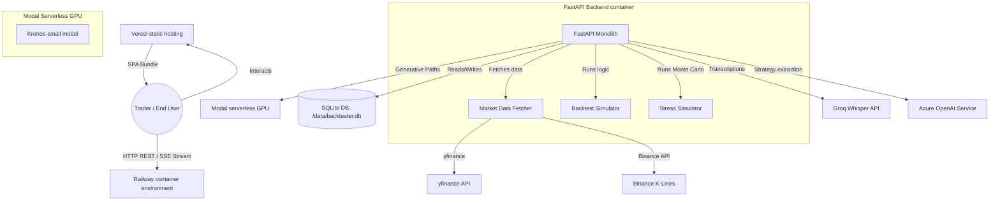
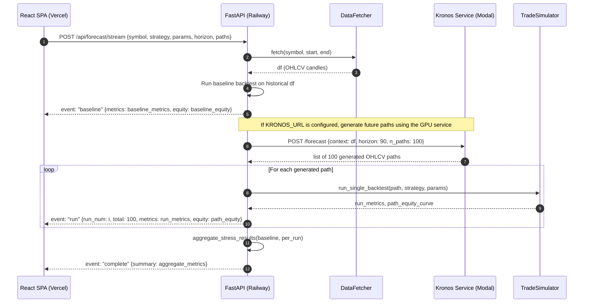
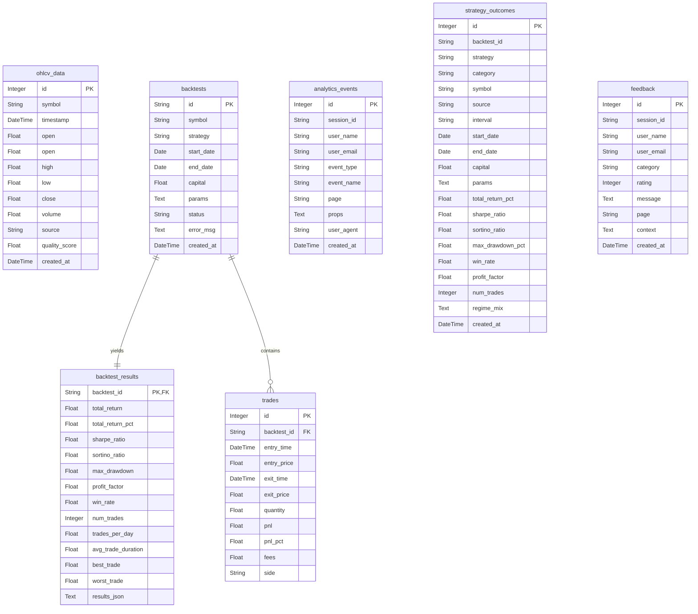

# Technical Documentation
## TradeVed: Quantitative Backtesting and Risk Analytics Platform

This document is the technical single source of truth for backend, frontend, DevOps, and AI engineers. It describes the architecture, codebase structures, database configurations, and external integrations of the TradeVed platform.

---

## 1. System Architecture

TradeVed uses a decoupled client-server architecture with an external serverless GPU executor:



### 1.1 Data Flow: Streaming Monte Carlo / AI Forecasts
When running Stress Tests or AI Forward Tests, the API utilizes **Server-Sent Events (SSE)** to stream results back to the client:



---

## 2. Codebase Structure

### 2.1 Backend Folder Layout
The backend resides in the `/backtester` root directory:
```
backtester/
├── main.py                    # FastAPI application, route declarations, lifecycle events
├── config.py                  # Configurations, environment variables, directories setup
├── database.py                # Database connection, set sqlite WAL mode, session generator
├── models.py                  # SQLAlchemy ORM model definitions
├── requirements.txt           # Python dependency locks
├── run_backtest.py            # CLI helper to run backtests without starting the web server
├── test_all.py                # pytest integration/unit test suite (43 tests)
├── stress_validation.py       # Stress tester validation (207 combinations)
├── data/                      # Data Fetching & Quality Validation
│   ├── fetcher.py             # Pull K-lines from Binance API, yfinance (delivery/F&O), CoinGecko
│   ├── indian_assets.py       # Hardcoded F&O lot sizes (lot_size maps), indexes symbols
│   └── validator.py           # Verification of missing candles and data gaps
├── strategies/                # Strategy rules and signal builders
│   ├── base.py                # BaseStrategy abstract parent class
│   ├── grid.py                # GRID strategy level-crossing algorithm
│   ├── dca.py                 # DCA interval buy and hold-exit evaluator
│   ├── pla.py                 # EMA crossovers + cascading levels averaged-down
│   ├── custom.py              # CUSTOM strategy AST conditions evaluator
│   └── oscillators.py         # indicator presets files (oscillators, trend, volume, etc.)
└── engine/                    # Simulation & Mathematical models
    ├── simulator.py           # TradeSimulator (WACB calculations, lot-size constraints, partial fills)
    ├── cost_models.py         # Cost models (IndianCostModel Budget 2024, SimpleCostModel)
    ├── metrics.py             # Math formulas (Sharpe, Sortino, Calmar, drawdown arrays)
    ├── regimes.py             # Timeframe-aware Moving Average market regime classifier
    ├── stress.py              # Perturbation functions for the 17 stress scenarios + MC jitter
    └── forecast.py            # Kronos HTTP client + local Circular Block Bootstrap generator
```

### 2.2 Frontend Folder Layout
The frontend is a Vite project in `/backtester/frontend/`:
```
backtester/frontend/
├── package.json               # dependency list (React, Recharts, Lucide-React)
├── tailwind.config.js         # custom color themes and spacing utilities
├── vite.config.ts             # Vite server proxies, target overrides, infinite timeout locks
└── src/
    ├── App.tsx                # main coordinator, keeps top nav tabs state ('backtest'|'stress'...)
    ├── api.ts                 # client APIs: runBacktest, streamStressTest, streamForwardTest
    ├── types.ts               # Form inputs and response TypeScript types
    └── components/            # UI components
        ├── Sidebar.tsx        # backtest form options, smart defaults trigger, lot size checks
        ├── StressSidebar.tsx  # stress form options, scenario groups, MC runs select
        ├── ChartsPanel.tsx    # main layout: Recharts Area (Equity), Area (Drawdown), Candlesticks
        ├── MCPathsCanvas.tsx  # high-performance HTML Canvas simulator (rainbow lines, delta mode)
        ├── RuleBuilder.tsx    # rule builder UI (add entries/exits conditions, logical joins)
        ├── StrategyParamsForm.tsx # dynamic inputs generator for indicator strategies schema
        ├── PlainLanguageVerdict.tsx # plain language verdict cards
        └── PaperTradeView.tsx # simulated trading viewport against generated candles
```

---

## 3. Database Schema

TradeVed uses a relational model. Below is the SQLAlchemy table map representing the schema in SQLite (`/data/backtester.db`):



### 3.1 Indexes & Uniques
*   `ohlcv_data`: UniqueConstraint on `(symbol, timestamp, source)` ensures no double entries. An index on `(symbol, timestamp)` ensures fast fetches during backtest queries.
*   `strategy_outcomes`: Index on `strategy`, `symbol`, and `created_at` optimized for lookups by recommendation services.
*   `analytics_events`: Index on `created_at` and `session_id`.

---

## 4. API Endpoints Catalog

### 4.1 POST `/api/backtest/run`
*   **Purpose:** Runs a standard historical backtest.
*   **Request Schema:**
    ```json
    {
      "symbol": "BTC/USDT",
      "strategy": "DCA",
      "start_date": "2023-01-01",
      "end_date": "2023-12-31",
      "capital": 10000,
      "strategy_params": {
        "buy_interval_hours": 24,
        "invest_per_buy_usd": 100
      },
      "source": "binance",
      "interval": "1d",
      "use_indian_costs": false,
      "market_type": "equity_delivery"
    }
    ```
*   **Response Schema (200 OK):**
    ```json
    {
      "backtest_id": "uuid-string",
      "metrics": {
        "total_return": 4500.0,
        "total_return_pct": 45.0,
        "sharpe_ratio": 1.45,
        "sortino_ratio": 1.95,
        "max_drawdown": -0.12,
        "profit_factor": 1.8,
        "win_rate": 58.5
      },
      "trades": [
        {
          "entry_time": "2023-01-02T00:00:00",
          "entry_price": 16500.0,
          "exit_time": "2023-01-05T00:00:00",
          "exit_price": 17200.0,
          "quantity": 0.006,
          "pnl": 4.2,
          "side": "LONG"
        }
      ],
      "equity_curve": [{"timestamp": "2023-01-01T00:00:00", "equity": 10000.0}],
      "regime_mix": {"bull": 120, "bear": 45, "sideways": 80}
    }
    ```
*   **Validation Rules:**
    *   `start_date` must be less than `end_date`.
    *   `capital` must cover at least 1 lot if `market_type` is `futures` or `options`.
*   **Error States:**
    *   `422 Unprocessable Entity` (raised if capital is insufficient for lot size, returning a guide message).
    *   `400 Bad Request` (data unavailable or symbol invalid).

### 4.2 GET `/api/strategies`
*   **Purpose:** Returns metadata for all 54 strategies, categorizing them and exposing parameter schemas dynamically so the frontend renders appropriate forms.
*   **Response Sample:**
    ```json
    {
      "GRID": {
        "category": "classic",
        "parameters": {"lower_bound": 0.0, "upper_bound": 0.0, "num_levels": 10}
      },
      "RSI": {
        "category": "indicator",
        "schema": {
          "length": {"type": "integer", "default": 14, "min": 2, "max": 100},
          "oversold": {"type": "number", "default": 30.0}
        }
      }
    }
    ```

### 4.3 POST `/api/stress/stream`
*   **Purpose:** SSE stream of Monte Carlo simulations under a stress preset.
*   **Request Schema:** Matches `/api/backtest/run` but includes `scenario` (string) and `monte_carlo_runs` (integer, e.g., 100).
*   **Response (Text Event-Stream):**
    *   `event: baseline` -> baseline metrics.
    *   `event: run` -> per-run metrics and subsampled (<=200 points) equity curve:
        ```json
        {"run_num": 1, "total": 100, "metrics": {"total_return_pct": -12.4}, "equity": [10000, 9800, 9200]}
        ```
    *   `event: complete` -> full aggregation result of all runs.

### 4.4 POST `/api/forecast/stream`
*   **Purpose:** Streams forward-test simulations generated via the Kronos service or block bootstrap.
*   **Request Schema:** Includes standard backtest payload + `horizon` (horizon candles, e.g., 90).
*   **Response:** Text event-stream (baseline, run, complete events).

### 4.5 POST `/api/reel/analyze`
*   **Purpose:** Extract trading rules from video URLs or text transcripts.
*   **Request Schema:** `{"url": "optional-string", "transcript": "optional-string"}`
*   **Response:**
    ```json
    {
      "strategy_ir": {
        "strategy": "CUSTOM",
        "params": {
          "entry_rules": [{"left": {"indicator": "rsi", "params": {"length": 14}, "output": "rsi"}, "operator": "<", "right": {"value": 30}}],
          "exit_rules": [{"left": {"indicator": "rsi", "params": {"length": 14}, "output": "rsi"}, "operator": ">", "right": {"value": 70}}],
          "logic": "AND"
        }
      },
      "gaps": ["No stop loss defined", "Timeframe not specified"],
      "confidence": 0.85
    }
    ```

---

## 5. Engineering & DevOps

### 5.1 Local Development Instructions
1.  **Backend Setup:**
    ```powershell
    cd backtester
    python -m venv venv
    venv\Scripts\activate
    pip install -r requirements.txt
    cp .env.example .env
    python main.py
    ```
2.  **Frontend Setup:**
    ```powershell
    cd frontend
    npm install
    npm run dev -- --port 5173
    ```

### 5.2 Environment Variables
*   `ADMIN_TOKEN`: Encryption key/token controlling dashboard authentication.
*   `DATABASE_URL`: Path to sqlite database (e.g. `sqlite:////data/backtester.db`).
*   `KRONOS_URL`: Target endpoint for serverless Modal GPU execution. If empty, local circular block bootstrap handles forecasts.
*   `AZURE_OPENAI_API_KEY` / `AZURE_OPENAI_ENDPOINT`: Target settings for GPT-Codex parser.
*   `GROQ_API_KEY`: Key to utilize `whisper-large-v3-turbo` for voice-to-text transcription.

---

## 6. Technical Debt & Future Architecture

1.  **Thread Blocking on Extraction:** Move synchronous LLM routes in `/api/reel/analyze` to a background task runner. Deploy **Redis** and **RQ** (Redis Queue) to isolate inference workloads from client requests.
2.  **SQLite Writer Locks:** SQLite handles concurrent reads but serializes writes. As outcome logs scale, migrate the backend connection string (`DATABASE_URL`) to **PostgreSQL**.
3.  **HMM Regime Upgrades:** Replace the Moving Average regime detection in `backtesting/backend/engine/regimes.py` with a multi-state Hidden Markov Model (HMM) to capture regime volatility shifts.
4.  **Vite Proxy Timeout Configurations:** Streaming endpoints can close due to HTTP gateway timeouts. Verify that both Railway's upstream proxy and Vercel's Edge routes allow long-lived connections.
